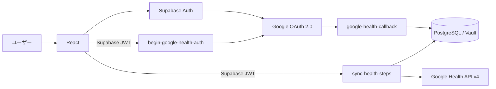
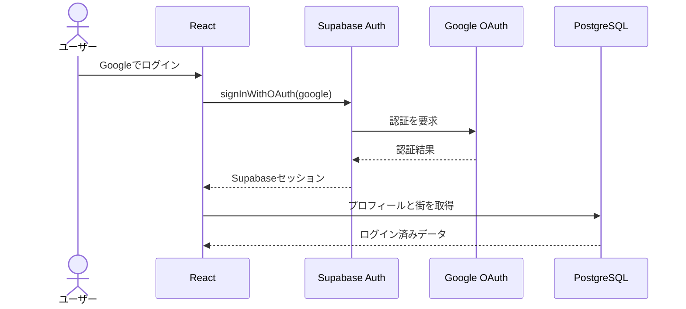
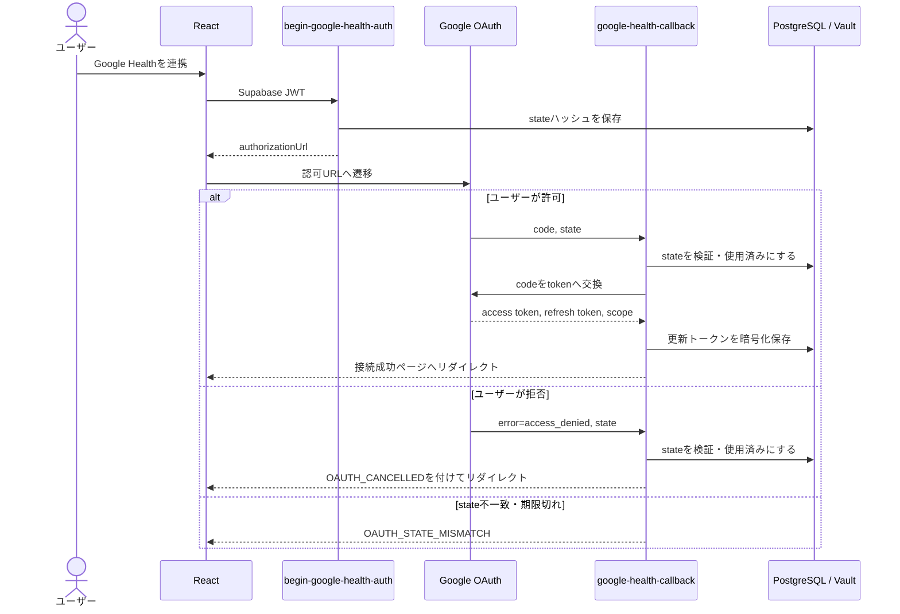
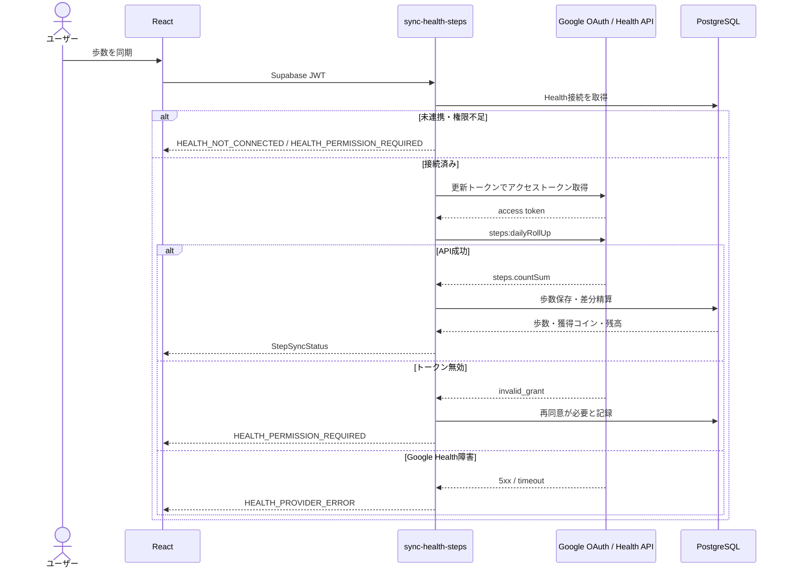
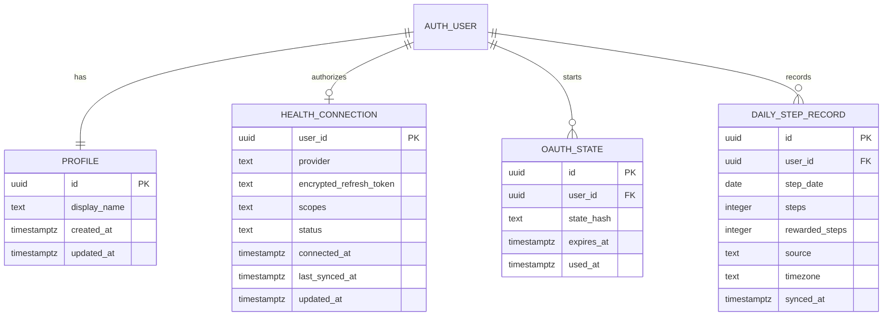

# Google 認証・Google Health 連携機能 Design Doc

| 項目 | 内容 |
|---|---|
| 対象プロダクト | Walk City |
| ステータス | Draft（レビュー待ち） |
| 作成日 | 2026-08-25 |
| 認証基盤 | Supabase Auth + Google OAuth 2.0 |
| 健康データ | Google Health API v4 |
| 最小スコープ | `googlehealth.activity_and_fitness.readonly` |

## 1. 概要

本機能は、Walk City への Google ログインと、Google Health API から歩数を読み取るための追加認可を提供する。

ログイン認証と健康データへのアクセス認可は目的と機密性が異なるため、次の二段階に分ける。

1. Supabase Auth の Google Provider でユーザーを認証する。
2. ログイン後、ユーザーが「Google Health を連携」を選んだ場合だけ、歩数読み取り専用スコープへの同意を求める。

Google Health のクライアントシークレット、アクセス・更新トークンはブラウザへ渡さない。Supabase Edge Function が OAuth コード交換、トークン更新、Google Health API 呼び出しを担当する。

参照した Google 公式資料:

- [最初の Google Health API 呼び出しを行う](https://developers.google.com/health/codelabs/make-your-first-api-call?hl=ja)
- [Google Cloud と OAuth を設定する](https://developers.google.com/health/setup?hl=ja)
- [ウェブサーバーアプリケーションに OAuth 2.0 を使用する](https://developers.google.com/identity/protocols/oauth2/web-server?hl=ja)
- [Steps データ型](https://developers.google.com/health/data-types/steps)
- [`dailyRollUp` リファレンス](https://developers.google.com/health/reference/rest/v4/users.dataTypes.dataPoints/dailyRollUp)

## 2. 目的と非目的

### 2.1 目的

- Google アカウントで Walk City にログイン・ログアウトできる。
- ページ再読み込み後も Supabase セッションを復元できる。
- Google Health の歩数読み取り権限を、ログインとは別に付与・解除できる。
- 日次歩数を Google Health API から安全に取得できる。
- Google Health の短時間アクセストークンを、更新トークンからサーバー側で更新できる。
- フロントエンドは実 API とモック API を同じ型で利用できる。
- 認証拒否、権限不足、トークン失効、外部 API 障害を区別して表示できる。

### 2.2 非目的

- Google Health へのデータ書き込み
- 心拍、睡眠、位置情報など、歩数以外の健康データ取得
- Google 以外のログインプロバイダー
- Fitbit Web API の直接利用
- 医療用途の判断や健康助言
- RISC API と Webhook の初期実装

## 3. 重要な設計判断

### 3.1 ログインと健康データ認可を分離する

Googleログインでは `openid email profile` 相当の本人識別に必要な情報だけを扱う。歩数が必要になったタイミングで、次のスコープを段階的に要求する。

```text
https://www.googleapis.com/auth/googlehealth.activity_and_fitness.readonly
```

これにより、ゲームを試すだけのユーザーへ最初から健康データへの同意を要求しない。健康データの同意を拒否しても、歩数連携以外のログイン済み機能は利用可能とする。

### 3.2 日次歩数は `dailyRollUp` を使用する

参照 Codelab は OAuth フローの確認後に `dataPoints.list` を呼び出す例を示している。Walk City は日次の合計歩数をコイン精算に使うため、生データをクライアントで単純合計せず、Google Health API の次のエンドポイントをサーバーから呼び出す。

```http
POST https://health.googleapis.com/v4/users/me/dataTypes/steps/dataPoints:dailyRollUp
```

`dailyRollUp` は civil time の日付範囲を使い、複数データソースの調整済み結果を `steps.countSum` として返す。日付境界はユーザーに適用するタイムゾーンと一致させる。

### 3.3 OAuth トークンをブラウザに保存しない

- クライアントシークレットは Supabase Secrets に保存する。
- 認可コードとトークンの交換は Edge Function が行う。
- 更新トークンはサーバー側で暗号化して保存する。
- Google Health API は Edge Function から呼び出す。
- フロントエンドへ返すのは接続状態、同期日時、正規化した歩数だけとする。

### 3.4 OAuth クライアントを用途別に分ける

同じ Google Cloud プロジェクト内に、次の二つの Web OAuth クライアントを用意することを推奨する。

| OAuth クライアント | 用途 | リダイレクト先 |
|---|---|---|
| Walk City Login | Supabase Auth の Google ログイン | Supabase Auth Callback |
| Walk City Health | Google Health の追加認可 | `google-health-callback` Edge Function |

認証設定と健康データ設定の変更影響を分離し、Health 用クライアントシークレットをフロントエンド設定へ混ぜない。

## 4. 全体構成



## 5. 詳細

### 5.1 Google ログイン

フロントエンドは Supabase Auth SDK で Google OAuth を開始する。

```ts
supabase.auth.signInWithOAuth({
  provider: 'google',
  options: {
    redirectTo: `${window.location.origin}/auth/callback`,
  },
})
```

ログイン成功時、Supabase JWT の `sub` をユーザー ID の正とする。初回ログイン時は、バックエンドが `profiles` と `towns` を冪等に作成する。

フロントエンドは OAuth リダイレクト後に `supabase.auth.getSession()` でセッションを復元し、ユーザー情報を表示する。URL 内の認証情報をログへ出さない。

### 5.2 Google Health 連携開始

`begin-google-health-auth` Edge Function の処理:

1. Supabase JWT を検証し、ユーザーを決定する。
2. 暗号学的に安全な `state` を生成する。
3. `state` のハッシュ、ユーザー ID、有効期限、使用済みフラグを保存する。
4. Google OAuth 認可 URL を生成する。
5. フロントエンドへ認可 URL を返す。
6. フロントエンドは認可 URL へ遷移する。

認可 URL の主要パラメータ:

| パラメータ | 値 |
|---|---|
| `client_id` | Health 用 OAuth クライアント ID |
| `redirect_uri` | 登録済み Edge Function Callback URL |
| `response_type` | `code` |
| `scope` | `googlehealth.activity_and_fitness.readonly` |
| `access_type` | `offline` |
| `include_granted_scopes` | `true` |
| `state` | 一回限りのランダム値 |

通常の再連携では既存同意を利用する。更新トークンが必要なのに返らない場合やスコープを変更する場合に限り、`prompt=consent` を付けて明示的に再同意を求める。

### 5.3 OAuth Callback

`google-health-callback` Edge Function の処理:

1. Google から `code`、`state`、または `error` を受け取る。
2. `state` のハッシュが保存値と一致し、未使用かつ有効期限内であることを確認する。
3. `state` を使用済みにする。同じ値を再利用できないようにする。
4. `error` がある場合は安全なエラーコードを付けてフロントエンドへ戻す。
5. `code` を Google Token Endpoint へ送り、トークンと交換する。
6. 付与されたスコープに必須スコープが含まれることを確認する。
7. 更新トークンを暗号化して `health_connections` へ保存する。
8. 接続成功ページへリダイレクトする。

Callback では、リクエストの Cookie だけに依存してユーザーを決定しない。保存済み `state` と開始時の認証ユーザーを結び付ける。

### 5.4 接続状態

接続状態は次の三値を基本とする。

```ts
type GoogleHealthConnectionStatus =
  | 'connected'
  | 'not_connected'
  | 'permission_required'
```

- `connected`: 必須スコープを持つ更新トークンが保存されている。
- `not_connected`: 接続情報がない、またはユーザーが解除した。
- `permission_required`: 接続情報はあるが、必須スコープ不足または再同意が必要。

アクセストークンの有効期限切れだけでは `permission_required` にしない。更新トークンを使用して再取得する。

### 5.5 日次歩数同期

`sync-health-steps` Edge Function の処理:

1. Supabase JWT からユーザーを決定する。
2. `health_connections` から暗号化された認可情報を取得する。
3. 更新トークンから有効なアクセストークンを取得する。
4. 対象日とタイムゾーンから civil time の閉開区間を作る。
5. Google Health API の `steps:dailyRollUp` を呼ぶ。
6. `steps.countSum` を安全に整数へ変換する。
7. 日別歩数を upsert し、未精算差分だけコインへ反映する。
8. 同期結果を返す。

初期リリースの日付境界とレスポンスの `timezone` は `Asia/Tokyo` に固定する。クライアントから対象日やタイムゾーンを受け取らず、Edge Function がサーバー時刻から対象日を決定する。

Google Health API の `int64` は JSON では文字列になるため、`countSum` を文字列として検証してから整数へ変換する。負数、小数、JavaScript の安全整数を超える値は外部 API エラーとして扱う。

データが存在しない場合と、端末を装着していて 0 歩だった場合は区別される可能性がある。ゲーム API は初期版ではどちらも `steps: 0` として返せるが、監査用メタデータにはデータ有無を保存する。

### 5.6 連携解除とログアウト

- ログアウトは Supabase セッションだけを終了する。
- ログアウトだけで Google Health の同意や保存済み接続を解除しない。
- 「Google Health 連携解除」は保存済み更新トークンを失効・削除し、接続状態を `not_connected` にする。
- 再ログインした同じユーザーには、保存済みの Health 接続状態を再表示する。

Google のトークン失効 API 呼び出しが失敗した場合でも、ローカルのトークンを削除して以後利用しない。外部失効失敗は監視対象として記録する。

## 6. 処理フロー

### 6.1 正常系: Google ログイン



### 6.2 正常系・異常系: Google Health 連携



### 6.3 正常系・異常系: 歩数同期



## 7. ER 図



`health_connections` は通常のユーザー向け Data API から直接読み書きできないようにする。更新トークン列は RLS だけに依存せず、アプリケーションレベルでも暗号化する。

## 8. アプリケーション API スキーマ

### 8.1 共通状態

```ts
type GoogleIntegrationState = {
  session: {
    user: {
      id: string
      displayName: string
      email: string
      avatarUrl: string | null
    }
    expiresAt: string
  } | null
  healthConnection: {
    status: 'connected' | 'not_connected' | 'permission_required'
    scopes: string[]
    connectedAt: string | null
    lastSyncedAt: string | null
  } | null
}
```

未ログイン時は `session: null`、`healthConnection: null` とする。Google のアクセストークンや更新トークンは含めない。

### 8.2 Health 認可開始

```ts
type StartGoogleHealthConnectionResult =
  | { next: 'redirect'; authorizationUrl: string }
  | { next: 'connected'; state: GoogleIntegrationState }
```

- 実 API は `next: 'redirect'` と認可 URL を返す。
- モック API は外部遷移を行わず、`next: 'connected'` と接続後状態を返す。

### 8.3 日次歩数

```ts
type GetDailyStepsInput = {
  date: string       // YYYY-MM-DD
  timezone: string   // IANA timezone
}

type DailySteps = {
  date: string
  timezone: string
  steps: number
  source: 'google_health'
  syncedAt: string
}
```

ゲームでコインを付与するときは、フロントエンド用 `getDailySteps` の自己申告値を信用せず、既存の `syncSteps()` API がサーバー上で取得・精算する。

### 8.4 エラーコード

| コード | 条件 | UI の動作 |
|---|---|---|
| `UNAUTHENTICATED` | Supabase セッションなし | 再ログインを案内 |
| `OAUTH_CANCELLED` | ユーザーが同意を拒否 | 拒否しても利用可能と案内 |
| `OAUTH_STATE_MISMATCH` | state 不一致・期限切れ・再利用 | 最初からやり直す |
| `HEALTH_NOT_CONNECTED` | 接続情報なし | 連携ボタンを表示 |
| `HEALTH_PERMISSION_REQUIRED` | スコープ不足・更新トークン失効 | 再同意を案内 |
| `HEALTH_PROVIDER_ERROR` | Google Health 障害・タイムアウト | 状態を推測せず再試行 |
| `INVALID_INPUT` | 日付・タイムゾーン不正 | 入力を修正 |
| `INTERNAL_ERROR` | その他 | 一般メッセージを表示 |

## 9. モック API

公開インターフェースと実装ファイル:

```text
frontend/src/features/auth/api/
└── google-integration-api.ts

frontend/src/features/auth/services/
└── google-integration.ts       # Supabase 実装

frontend/src/mocks/services/
└── google-integration.ts       # モック実装
```

モックは次を提供する。

- Googleログイン、ログアウト
- Google Health連携、解除
- 日付ごとの歩数取得
- 150 ms の疑似通信時間
- 操作単位のエラー注入
- テスト用歩数の変更
- 状態のリセット

アプリ実行時は `VITE_API_MODE=mock|supabase` を `ApiProvider` が解決する。Page と Feature Component はモックを直接 import しない。

モック単体テストでの使用例:

```ts
import { createMockGoogleIntegrationApi } from './mocks/services'

const api = createMockGoogleIntegrationApi({ latencyMs: 0 })

const signInResult = await api.signInWithGoogle()

const connectionResult =
  await api.startGoogleHealthConnection()

const stepsResult = await api.getDailySteps({
  date: '2026-08-25',
  timezone: 'Asia/Tokyo',
})
```

エラーケース:

```ts
api.setFailure(
  'startGoogleHealthConnection',
  'OAUTH_CANCELLED',
)

const result =
  await api.startGoogleHealthConnection()

api.setFailure(
  'startGoogleHealthConnection',
  null,
)
```

歩数変更:

```ts
api.setSteps('2026-08-25', 12345)
```

モックは認証情報を生成・保存せず、GoogleやSupabaseへ通信しない。本番用実装へ切り替えるときも、UI は `GoogleIntegrationApi` インターフェースを使い続ける。

## 10. セキュリティ要件

- OAuth `redirect_uri` は Google Cloud の登録値と完全一致させる。
- OAuth `state` は十分な長さのランダム値とし、ハッシュ保存、一回限り、短い有効期限にする。
- Client Secret、Access Token、Refresh Token を Git、ブラウザ、URL、ログへ出さない。
- Health のスコープは歩数読み取り専用だけに限定する。
- 更新トークンは暗号化し、Edge Function 以外から読み取れないようにする。
- Supabase JWT のユーザーと `health_connections.user_id` を必ず一致させる。
- Google API 応答をスキーマ検証し、歩数値を信用して直接DBへ書かない。
- OAuth Callback のエラーをそのまま画面へ表示せず、安定した内部エラーコードへ変換する。
- トークンを含む可能性がある HTTP ヘッダー・本文を監視ログへ残さない。

## 11. テスト計画

### 11.1 単体テスト

- 未ログイン状態からログイン済み状態へ遷移する。
- ログアウト後は公開状態の `healthConnection` が `null` になる。
- 同じユーザーで再ログインすると保存済み Health 接続を復元できる。
- Health 未接続時の歩数取得が `HEALTH_NOT_CONNECTED` になる。
- 不正な日付・空タイムゾーンが `INVALID_INPUT` になる。
- モックのエラー注入とリセットが動作する。

### 11.2 統合テスト

- OAuth state の不一致、期限切れ、再利用を拒否する。
- 必須スコープがないトークンを `permission_required` とする。
- 更新トークンをブラウザレスポンスへ含めない。
- `dailyRollUp` の `countSum` を正しく整数へ変換する。
- 同じ歩数を再同期してもコインを二重付与しない。
- Googleの `invalid_grant` を `HEALTH_PERMISSION_REQUIRED` に変換する。
- Google Health の 429、5xx、タイムアウトを `HEALTH_PROVIDER_ERROR` に変換する。

### 11.3 手動確認

- Google Cloud のテストユーザーがログインできる。
- Health 同意を拒否してもアプリへ戻れる。
- Health 同意後に今日の歩数を取得できる。
- ログアウトとHealth連携解除が別操作になっている。
- ブラウザのStorage、URL、開発者ツールのレスポンスにHealthトークンが存在しない。

## 12. Google Cloud 設定チェックリスト

1. Google Cloud プロジェクトで Google Health API を有効化する。
2. OAuth 同意画面を外部・テスト中として構成する。
3. 開発メンバーの Google アカウントをテストユーザーへ追加する。
4. 歩数読み取り専用スコープを追加する。
5. Login 用と Health 用の Web OAuth クライアントを作成する。
6. Supabase Auth Callback と Health Edge Function Callback をそれぞれ承認済み URI に登録する。
7. Client Secret を Supabase Secrets に登録し、Gitへ追加しない。
8. 本番公開前にGoogleの確認・セキュリティレビュー要件を確認する。

Google公式資料では、未確認の新規OAuthクライアントはテストユーザーの登録が必要で、Google Health APIを100人超で提供する場合は第三者セキュリティレビューが必要とされている。テスト中に発行される更新トークンは7日で期限切れになるため、開発時の再同意を想定する。

## 13. 実装順序と完了条件

### 13.1 実装順序

1. 本書のモック API を使ったログイン・Health 接続 UI
2. Supabase Google Provider とセッション復元
3. `oauth_states`、`health_connections` の migration と RLS
4. `begin-google-health-auth` と Callback Edge Function
5. `steps:dailyRollUp` を使う歩数取得アダプター
6. 既存 `sync-health-steps` の差分精算との接続
7. エラー、再同意、連携解除、監視

### 13.2 完了条件

- Googleログイン、ログアウト、セッション復元が動作する。
- Google Healthの追加同意、状態表示、解除が動作する。
- 日次歩数をサーバー側で取得し、二重付与なく精算できる。
- ブラウザとログへHealthトークンが露出しない。
- モックと実APIが同じ `GoogleIntegrationApi` 境界で利用できる。
- 正常系と主要エラー系のテストが通る。

## 14. 未確定事項

- Health 用トークンの暗号化方式と鍵ローテーション
- OAuth state の有効期限
- GoogleログインとHealth連携でOAuthクライアントを分ける運用の最終決定
- 本番公開時のGoogle OAuth確認・第三者セキュリティレビュー計画
- ユーザーがタイムゾーンを変更した場合の過去歩数再集計ルール

## 15. 関連文書

- [システムアーキテクチャ](./architecture.md)
- [バックエンド設計書](./バックエンド.md)
- [フロントエンド設計書](./フロントエンド.md)
- [API 設計書](./API計画書.md)
