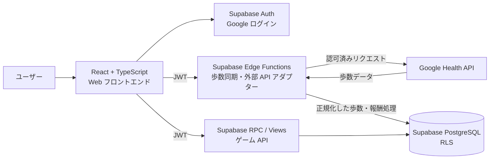
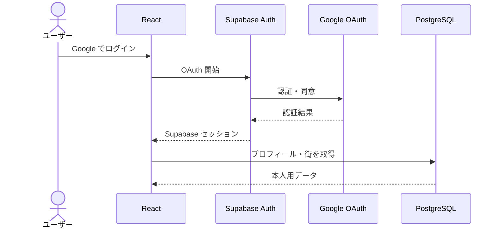
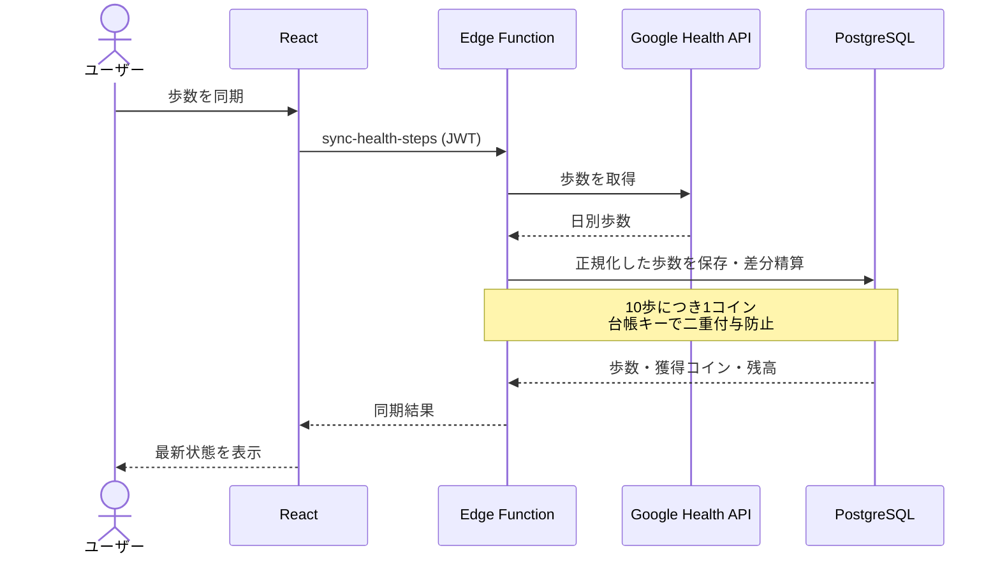
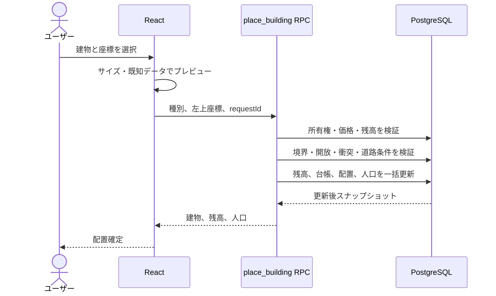
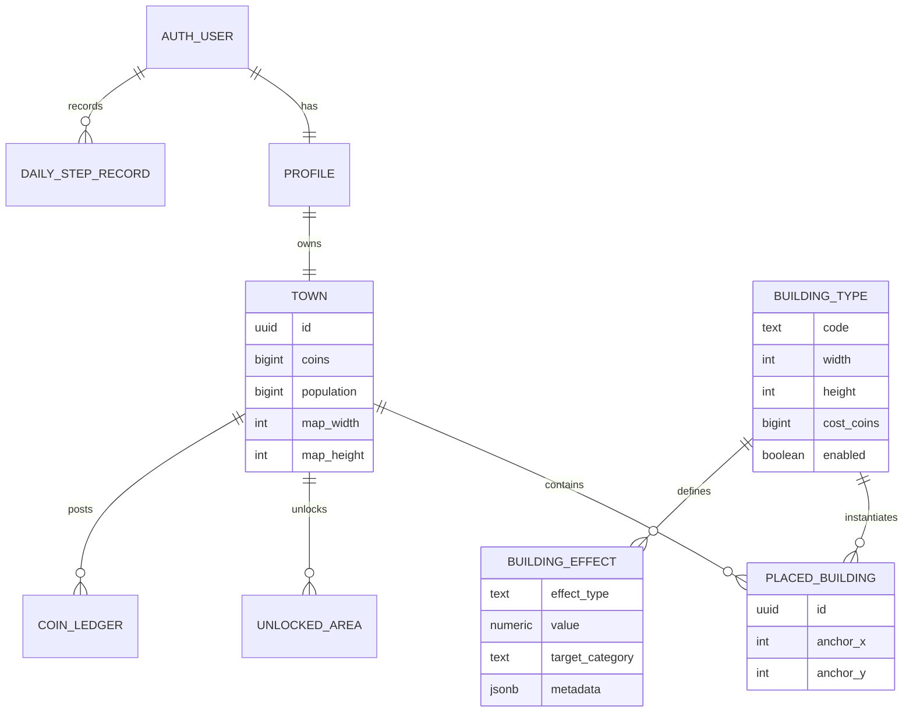

# Walk City システムアーキテクチャ

## 1. システム概要

Walk City は、Google Health から取得した歩数をコインへ変換し、そのコインで街の建物や道路を購入・配置する Web ゲームである。

建物は人口や歩数報酬へ効果を与える。全ユーザーの人口ランキングを閲覧でき、ランキングなどから他ユーザーの街を訪問できる。

## 2. 全体構成



## 3. コンポーネントの責務

| コンポーネント | 責務 | 信頼境界 |
|---|---|---|
| React フロントエンド | UI、マップ描画、操作プレビュー、認証開始、API 呼び出し | 表示・入力補助。ゲーム確定値は作らない |
| Supabase Auth | Google ログイン、セッション、ユーザー ID | 認証の正 |
| Edge Function | Google Health 接続、歩数の取得と正規化、同期の調整 | 外部 API と内部ゲームの境界 |
| RPC / DB Function | 購入、配置、移動、土地開放、コイン・人口更新 | 原子的なゲーム操作 |
| PostgreSQL | ユーザー、街、配置、歩数、台帳、カタログ、ランキング | 永続データの正 |
| RLS | 本人データと公開データの分離 | 認可の最終防御 |
| Google Health API | 歩数データの提供 | 外部システム。失敗・遅延を前提にする |

## 4. 主要データフロー

### 4.1 ログイン



Google ログインと歩数データへの同意が別スコープの場合、歩数連携を別フローとして提供する。

### 4.2 歩数同期とコイン付与



クライアントから自己申告の歩数を受け取ってコインを付与しない。同じデータの再同期は冪等にする。

### 4.3 建物の購入と配置



検証または更新のどこかが失敗した場合はすべてロールバックする。

### 4.4 ランキングから街を訪問


公開レスポンスにコイン、歩数、Google 連携情報を含めない。

## 5. ドメインモデル



建物本体と効果を分離することで、公園や病院へ将来効果を追加するときもテーブル構造や配置 API を変えずに済む。

## 6. マップ設計

```text
原点 (0,0) ───────────────→ x
  │  ┌─────────────────────┐
  │  │ 最大 100×100         │
  │  │                     │
  │  │  初期開放 20×20      │  中央 (40,40)〜(59,59)
  │  │                     │
  ↓  └─────────────────────┘
  y
```

- 1セルを 1×1 の論理単位とする。
- 建物・道路は 1×1 または 2×2。
- 座標は左上アンカー。
- 回転は不可。
- 移動は可能。
- 土地開放は20×20単位・1000コイン。上下左右の辺隣接のみ許可し、斜めは不可。
- 障害物と建物削除は TBD。
- 道路は周辺建築を許可する（上下左右の4方向、斜めは含めない）。

## 7. 建物と効果

| 建物 | サイズ | 効果 |
|---|---:|---|
| 住宅（小） | 1×1 | 人口 +10 |
| 住宅（大） | 2×2 | 人口 +50 |
| 公園（小） | 1×1 | 現時点なし |
| 病院 | 2×2 | 現時点なし |
| 商業施設 | 1×1 | なし |
| 農場 | 2×2 | なし |
| 道路 | 1×1 | 建物効果なし。道路隣接・橋はマップルール |
| 役所 | 2×2 | なし |
| 工場 | 2×2 | なし |

コストはPhase 0の暫定値を使用する。`building_effects`を持つのは住宅（小）と住宅（大）だけとする。

住宅（小）の基礎人口は10人、住宅（大）の基礎人口は50人とする。

## 8. セキュリティ境界

### フロントエンドを信用しない値

- ユーザー ID
- Google Health の歩数
- コイン残高と付与量
- 建物価格・サイズ・効果
- 人口
- 土地開放状態
- ランキング順位

### 必須対策

- JWT から本人を決定する。
- RLS を全ユーザーデータへ適用する。
- Service Role Key をブラウザへ置かない。
- Google のトークンを公開テーブルやレスポンスへ出さない。
- コイン更新は台帳と一意キーで冪等にする。
- 購入・配置はトランザクションで行う。
- 公開街用 View / RPC では非公開列を明示的に除外する。
- Edge Function の入力・外部 API 応答を検証する。

## 9. フロントエンドとバックエンドの開発境界

```text
フロントエンド担当                 共有契約                 バックエンド担当
画面・マップ・操作       <->  API計画書 / TS型  <->  Auth・DB・Edge Function
モック・UI状態            <->  エラーコード       <->  RLS・RPC・トランザクション
配置プレビュー            <->  座標・サイズ規約    <->  配置の最終検証
```

並行開発の最初に固定する項目:

1. 座標系と 2×2 のアンカー規則
2. `BuildingCatalogItem` と `TownDetail` の型
3. `syncSteps`、`placeBuilding`、`moveBuilding` の入出力
4. エラーコード
5. モックデータと契約テスト

バランス値は型から分離し、後から変更可能にする。

## 10. 実装順序

1. Supabase Auth とユーザー・街の初期作成
2. API 型、建物カタログ、RLS
3. 100×100 マップと初期 20×20 の読み取り表示
4. 購入・1×1/2×2 配置・移動の RPC
5. Google Health 連携と冪等な歩数同期
6. コイン効果と人口計算
7. 人口ランキングと公開街
8. 20×20・1000コインの土地開放

## 11. 主要な未確定事項

実装開始前、または該当機能に着手する前に次を決定する。

- 利用する Google Health API と OAuth スコープ
- 建物価格
- 最初の道路の配置条件
- 障害物、建物削除
- ランキングの同率・ページング仕様

## 12. 関連文書

- [Google 認証・Google Health 連携機能 Design Doc](./Google認証機能DesignDoc.md)
- [Map 機能 Design Doc](./map機能DesignDoc.md)
- [フロントエンド設計書](./フロントエンド.md)
- [バックエンド設計書](./バックエンド.md)
- [API 設計書](./API計画書.md)
