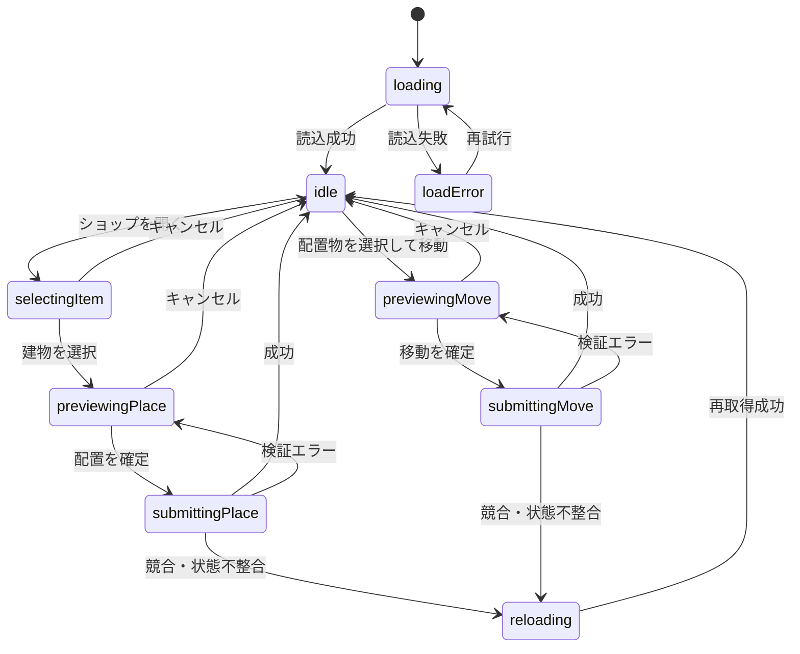
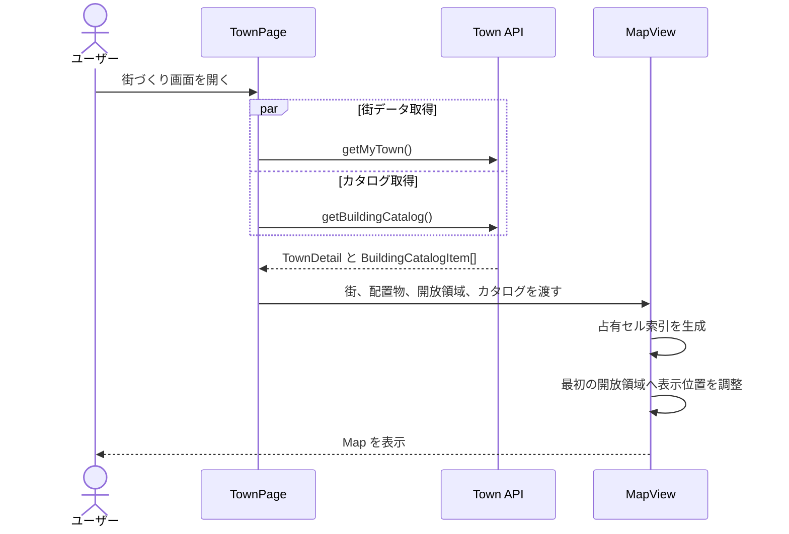
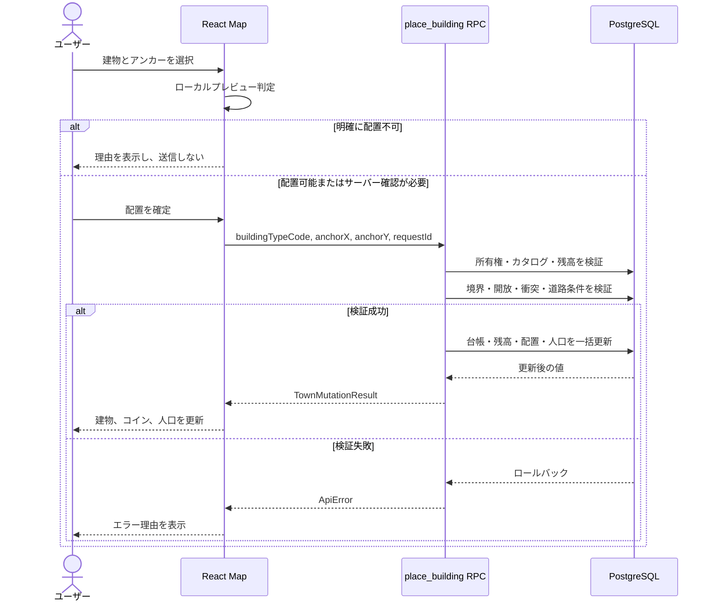
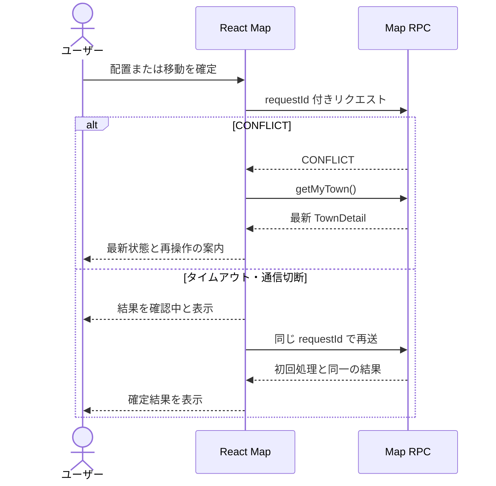
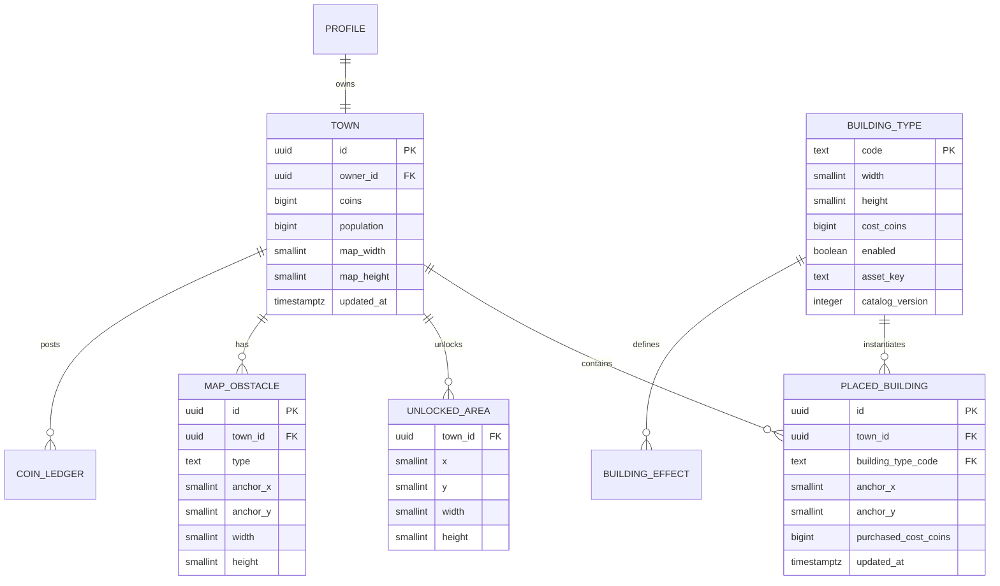

# Map 機能 計画書

| 項目 | 内容 |
|---|---|
| 対象プロダクト | Walk City |
| ステータス | Draft（レビュー待ち） |
| 作成日 | 2026-08-25 |
| 対象 | 自分の街の編集、他ユーザーの街の閲覧 |
| 関連 API | `getMyTown`、`getPublicTown`、`getBuildingCatalog`、`placeBuilding`、`moveBuilding` |

## 1. 概要

Map 機能は、Walk City の 100×100 セルの街を表示し、開放済みの土地に 1×1 または 2×2 の建物・道路を購入配置、移動する機能である。同じ描画コンポーネントを使って、他ユーザーの街を閲覧専用で表示する。

フロントエンドは、取得済みデータを使って配置可否を事前表示し、ユーザーの操作を補助する。コイン残高、所有権、建物サイズ、開放状態、衝突、道路条件を含む最終的な配置可否はバックエンドが判定する。

本書は、短期間のチーム開発で認識差による手戻りを防ぐため、[ハッカソンでドキュメントを書く【Design Doc】](https://qiita.com/K-Kizuku/items/3813152b1c34c382c842) の構成を参考に、概要、詳細、正常系・異常系、シーケンス図、ER 図、スキーマを一つにまとめる。

## 2. 目的と非目的

### 2.1 目的

- 最大 100×100 の街を PC とスマートフォンで表示できる。
- 開放済み・未開放・占有済みのセルを視覚的に区別できる。
- 1×1、2×2 の建物を正しい座標でプレビューし、購入配置できる。
- 配置済み建物を移動できる。
- API が拒否した理由をユーザーへ伝え、サーバー状態と表示を再同期できる。
- 自分の街と他ユーザーの街で同じ座標・描画規則を使う。

### 2.2 非目的

次の項目は仕様が確定するまで Map 機能の初期リリースに含めない。

- 建物の回転、削除、売却
- 土地開放の実行
- 障害物の生成・編集
- 建物アニメーションや天候などの演出
- オフライン編集、複数操作の一括送信
- リアルタイム共同編集

土地開放領域と障害物は API から受信・描画できる型だけを維持する。

## 3. 用語

| 用語 | 定義 |
|---|---|
| セル | マップ上の 1×1 の論理単位 |
| アンカー | 配置物が占有する矩形の左上座標 |
| ワールド座標 | 0〜99 の整数で表すマップ上のセル座標 |
| スクリーン座標 | ブラウザ画面上のピクセル座標 |
| 開放領域 | ユーザーが建築できるセルを含む矩形 |
| 配置プレビュー | API 送信前に予定位置と既知の可否を示す一時表示 |
| 編集モード | 自分の街で購入配置・移動ができる状態 |
| 閲覧モード | 他ユーザーの街など、Map を操作できない状態 |

## 4. 詳細

### 4.1 画面構成

```text
┌──────────────────────────────────────────────┐
│ 戻る  街名        コイン        人口          │
├──────────────────────────────┬───────────────┤
│                              │ 建物ショップ  │
│          Map Viewport        │ ・建物一覧    │
│      パン・ズーム可能         │ ・価格/効果   │
│                              │ ・選択解除    │
│                  ＋ － ⟳     │               │
├──────────────────────────────┴───────────────┤
│ 選択中の建物 / 配置理由 / [配置する]          │
└──────────────────────────────────────────────┘
```

- PC では Map とショップを横並びにする。
- スマートフォンでは Map を上部、ショップを下部のドロワーまたはパネルとして表示する。
- Map 上にズームイン、ズームアウト、初期位置へ戻す操作を置く。
- 閲覧モードではショップ、配置ボタン、移動操作を表示しない。

### 4.2 座標規則

- マップ全体は 100×100 セルとする。
- 原点は左上 `(0, 0)` とする。
- `x` は右方向、`y` は下方向に増加する。
- 有効範囲は `0 <= x < 100`、`0 <= y < 100` とする。
- 配置座標は建物矩形の左上アンカーとする。
- 建物サイズはカタログの `width`、`height` を使用する。
- 回転は行わない。
- 初期開放範囲を左上（40,40）、左下（40,59）、右上（59,40）、右下（59,59）とする。

幅 `w`、高さ `h` の配置物が `(x, y)` をアンカーとするとき、占有セルは次で求める。

```text
occupiedCells = {
  (cx, cy) |
  x <= cx < x + w AND y <= cy < y + h
}
```

例えば `(3, 4)` に配置した 2×2 建物は、`(3,4)`、`(4,4)`、`(3,5)`、`(4,5)` を占有する。

### 4.3 描画方式

初期実装では React と HTML/CSS を使用し、1万個のセル要素を常時生成しない。

- Map 全体を一つの `MapSurface` として絶対配置する。
- グリッド線は CSS の `repeating-linear-gradient` で描画する。
- 建物、開放領域、障害物、プレビューだけを要素として描画する。
- `MapSurface` に `translate(panX, panY) scale(zoom)` を適用する。
- 基準セルサイズは 32 px とし、ズーム倍率は 0.5〜2.0 に制限する。
- 初回表示は、API が返した最初の開放領域全体が Viewport に収まる位置と倍率にする。
- 開放領域が空の場合はマップ中央を表示し、空状態を案内する。

この方式により、100×100 の背景を表示しても DOM 数は配置物数にほぼ比例する。将来、配置物が増えて操作性能を満たせない場合に限り Canvas または描画範囲の仮想化を検討する。

### 4.4 スクリーン座標からセル座標への変換

ポインター位置を `(pointerX, pointerY)`、Viewport 左上を `(viewportLeft, viewportTop)`、パン量を `(panX, panY)`、倍率を `zoom`、基準セルサイズを `cellSize` とする。

```ts
const worldPixelX = (pointerX - viewportLeft - panX) / zoom
const worldPixelY = (pointerY - viewportTop - panY) / zoom

const anchorX = Math.floor(worldPixelX / cellSize)
const anchorY = Math.floor(worldPixelY / cellSize)
```

算出結果がマップ外の場合はプレビューを無効にする。API へ小数座標を送信しない。

### 4.5 表示レイヤー

下から次の順序で描画する。

1. 未開放地を表す Map 背景
2. 開放領域
3. グリッド線
4. 障害物
5. 配置済み建物・道路
6. 選択中セルと配置プレビュー
7. エラー理由、ローディングなどの UI

表示の意味は色だけに依存させない。未開放地にはパターン、配置不可プレビューにはアイコンまたは文言を併用する。

### 4.6 操作状態



配置または移動の送信中は、Map の確定操作を無効化する。パンとズームは許可してよいが、同じ操作を二重送信しない。

### 4.7 PC とスマートフォンの操作

| 操作 | PC | スマートフォン |
|---|---|---|
| パン | ドラッグ | 1本指ドラッグ |
| ズーム | ホイール、`+` / `-` | ピンチ、`+` / `-` |
| 配置候補選択 | セルをクリック | セルをタップ |
| 配置確定 | 確認ボタン | 確認ボタン |
| 移動開始 | 建物を選択し「移動」 | 建物をタップし「移動」 |
| キャンセル | Esc またはボタン | ボタン |

パン操作とセル選択を区別するため、ポインター移動が一定値を超えた場合はクリック・タップとして扱わない。誤購入を防ぐため、セル選択だけで API を呼ばず、必ず確認操作を挟む。

### 4.8 ローカル配置プレビュー

フロントエンドは、取得済みの `TownDetail` と `BuildingCatalogItem` だけを使い、次の確定済みルールを事前確認する。

```text
全占有セルがマップ内
AND 全占有セルが開放領域内
AND 配置済み建物と非衝突
AND 障害物と非衝突
AND カタログ項目が enabled
AND costCoins が null ではない
AND 表示中の残高が価格以上
```

道路隣接など、フロントエンドだけでは確定できない条件は「サーバー確認が必要」として配置操作を許可する。プレビューの結果は次の三値で表現する。

```ts
type PlacementPreviewStatus =
  | { status: 'valid' }
  | { status: 'invalid'; reason: PreviewInvalidReason }
  | { status: 'unknown'; message: string }
```

ローカル判定が `valid` でも、サーバーの成功を保証しない。

### 4.9 購入配置

1. ユーザーがショップから建物を選択する。
2. Map は選択した建物の大きさに対応するプレビューを表示する。
3. ユーザーがアンカー座標を選択し、配置を確定する。
4. フロントエンドは UUID の `requestId` を生成し、`placeBuilding` を呼ぶ。
5. バックエンドは認証、所有権、カタログ、残高、境界、開放、衝突、道路条件を検証する。
6. バックエンドはコイン台帳、残高、配置、人口を一つのトランザクションで更新する。
7. フロントエンドは成功レスポンスを反映し、選択状態を解除する。

通信失敗時の再送では同じ `requestId` を使う。ユーザーがキャンセルして新しく配置し直す場合は新しい `requestId` を生成する。

### 4.10 建物移動

1. ユーザーが自分の配置済み建物を選択する。
2. 詳細 UI から「移動」を選択する。
3. Map は元の建物を移動対象として表示し、移動先のプレビューでは対象自身を衝突判定から除外する。
4. ユーザーが新しいアンカー座標を確定する。
5. フロントエンドは `moveBuilding` を呼ぶ。
6. バックエンドは所有権、境界、開放、衝突、道路条件を再検証し、配置と人口を更新する。
7. 成功後、Map は新しい座標を反映する。

移動ではコインを消費しない。元と同じ座標への移動はフロントエンドで確定ボタンを無効化する。

### 4.11 閲覧モード

- `getPublicTown(userId)` の `TownDetail` を同じ Map コンポーネントへ渡す。
- `editable: false` の場合、ショップ、プレビュー、購入、移動、土地開放操作を無効化する。
- 公開レスポンスにコイン、歩数、Google 連携情報を含めない。
- URL やフロントエンド状態を変更しても、他ユーザーの街を更新できないようバックエンドで所有権を検証する。

## 5. 処理フロー

### 5.1 正常系: Map 初期表示



### 5.2 正常系・異常系: 建物の購入配置



### 5.3 異常系: 競合と通信結果不明



## 6. ER 図

Map 機能に関係する論理モデルを示す。土地開放をセルと矩形のどちらで保存するかは未確定だが、クライアントには矩形の `UnlockedArea` として返す。



## 7. スキーマ

正規の共通契約は [API計画書.md](./API計画書.md) とし、ここでは Map 機能が使用する部分を示す。

### 7.1 読み取り型

```ts
type TownDetail = {
  town: {
    id: string
    owner: { id: string; displayName: string }
    name: string
    coins?: number
    population: number
    mapWidth: 100
    mapHeight: 100
  }
  buildings: PlacedBuilding[]
  unlockedAreas: UnlockedArea[]
  obstacles: MapObstacle[]
  catalogVersion: number
  editable: boolean
}

type PlacedBuilding = {
  id: string
  buildingTypeCode: string
  anchorX: number
  anchorY: number
  createdAt: string
  updatedAt: string
}

type UnlockedArea = {
  x: number
  y: number
  width: number
  height: number
}

type MapObstacle = {
  id: string
  type: string
  anchorX: number
  anchorY: number
  width: number
  height: number
}
```

### 7.2 カタログ型

```ts
type BuildingCatalogItem = {
  code: string
  name: string
  category: string
  width: 1 | 2
  height: 1 | 2
  costCoins: number | null
  enabled: boolean
  description: string
  effects: BuildingEffect[]
  assetKey: string
  catalogVersion: number
}
```

Map は建物画像を `assetKey` から解決する。未対応または読込失敗時は、建物名を含む共通プレースホルダーを表示する。

### 7.3 購入配置

```ts
type PlaceBuildingInput = {
  buildingTypeCode: string
  anchorX: number
  anchorY: number
  requestId: string
}
```

### 7.4 移動

```ts
type MoveBuildingInput = {
  buildingId: string
  anchorX: number
  anchorY: number
  requestId: string
}
```

### 7.5 更新成功レスポンス

```ts
type TownMutationResult = {
  building: PlacedBuilding
  coinBalance: number
  population: number
  updatedAt: string
}
```

### 7.6 Map 内部型

```ts
type MapMode =
  | { type: 'idle' }
  | { type: 'placing'; item: BuildingCatalogItem; anchor: Cell | null; requestId: string }
  | { type: 'moving'; buildingId: string; anchor: Cell | null; requestId: string }
  | { type: 'submitting'; operation: 'place' | 'move' }

type Cell = { x: number; y: number }

type PreviewInvalidReason =
  | 'OUT_OF_MAP'
  | 'LAND_LOCKED'
  | 'CELL_OCCUPIED'
  | 'CATALOG_ITEM_DISABLED'
  | 'PRICE_NOT_SET'
  | 'INSUFFICIENT_COINS'
```

## 8. エラー処理

| API エラー | Map の動作 | ユーザーへの案内 |
|---|---|---|
| `UNAUTHENTICATED` | 編集を停止 | 再ログインを案内する |
| `INVALID_INPUT` | プレビューを維持 | 入力を確認して再選択するよう案内する |
| `CATALOG_ITEM_DISABLED` | 選択を解除しカタログ再取得 | 現在購入できないことを表示する |
| `PRICE_NOT_SET` | 選択を解除 | 価格準備中と表示する |
| `INSUFFICIENT_COINS` | 最新残高を反映 | コイン不足を表示する |
| `OUT_OF_MAP` | 不可位置を強調 | マップ内を選ぶよう案内する |
| `LAND_LOCKED` | 未開放パターンを強調 | 開放済みの土地を選ぶよう案内する |
| `CELL_OCCUPIED` | 街を再取得 | 他の建物と重なっていることを表示する |
| `ROAD_REQUIRED` | プレビューを維持 | 道路条件を満たす位置を選ぶよう案内する |
| `NOT_OWNER` | 編集を停止 | この街は編集できないと表示する |
| `NOT_FOUND` | 街または建物を再取得 | 対象が存在しないと表示する |
| `CONFLICT` | `getMyTown()` で再同期 | 街が更新されたため再操作を案内する |
| `INTERNAL_ERROR` | 確定前表示を残して再試行可能にする | 時間をおいて再試行するよう案内する |

タイムアウトなど処理結果が不明な場合、成功と推測して表示を更新しない。同一 `requestId` で再送するか、街を再取得して結果を確認する。

## 9. バックエンドの検証と整合性

`place_building` と `move_building` は、次の処理をバックエンドの一つのトランザクションで行う。

1. JWT からユーザーを決定する。
2. 対象の街をロックし、所有権を確認する。
3. 建物種別、有効状態、サイズ、価格をサーバーカタログから取得する。
4. 全占有セルについて境界、開放状態、衝突、障害物、道路条件を検証する。
5. 購入時のみ残高を検証し、コイン台帳と残高を更新する。
6. 配置または座標を更新する。
7. 人口を再計算する。
8. 更新後のスナップショットを返す。

どこか一つでも失敗した場合は全更新をロールバックする。クライアントが送信したユーザー ID、サイズ、価格、コイン、人口は使用しない。

## 10. 性能・アクセシビリティ・セキュリティ

### 10.1 性能目標

- 配置物 500 個の街で、パン・ズーム中の操作が体感上停止しない。
- Map 初期表示後、パン・ズームでネットワーク通信を発生させない。
- ポインター移動ごとの占有判定は、`"x:y"` をキーにした占有セル索引で行う。
- `MapBuilding` は入力が変わらない限り不要に再描画しない。
- Map データの取得中は、前画面の残高や配置を新しい街の情報として表示しない。

### 10.2 アクセシビリティ

- ズーム操作をボタンでも提供し、ピンチやホイールを必須にしない。
- 建物には建物名をアクセシブル名として設定する。
- 配置可否を色だけで表現しない。
- エラーは Map 上の色変更だけでなくテキストでも通知する。
- `Esc` で配置・移動をキャンセルできる。

### 10.3 セキュリティ

- 編集可否を `editable` だけで保証しない。バックエンドで JWT と所有権を検証する。
- ブラウザへ Supabase Service Role Key を置かない。
- 公開街レスポンスからコイン、歩数、Google 連携情報を除外する。
- エラーメッセージへ SQL、内部 ID、トークンなどの機密情報を含めない。
- `requestId` は更新の冪等性に使い、認証や所有権の代わりにしない。

## 11. テスト計画

### 11.1 単体テスト

- スクリーン座標を正しいセル座標へ変換できる。
- 100×100 の四隅で境界判定が正しい。
- 1×1、2×2 の占有セルを正しく列挙できる。
- 複数の開放矩形に対する開放判定が正しい。
- 自分自身を除外した移動時の衝突判定が正しい。
- 未知の `buildingTypeCode` や `assetKey` でも Map 全体が壊れない。

### 11.2 コンポーネントテスト

- 読込中、空状態、読込失敗、再試行を表示できる。
- `editable: false` では編集操作が表示されない。
- ショップ選択から配置プレビュー、キャンセルへ遷移できる。
- 送信中に配置操作を二重送信しない。
- API エラーごとに正しい案内を表示する。
- 成功後に建物、コイン、人口が更新される。

### 11.3 API 契約・統合テスト

- 同じ `requestId` の再送で二重購入されない。
- 2×2 建物を `(99, 99)` に配置すると `OUT_OF_MAP` になる。
- 未開放セルを一つでも含む配置は `LAND_LOCKED` になる。
- 既存配置と一セルでも重なると `CELL_OCCUPIED` になる。
- 他ユーザーの建物移動は `NOT_OWNER` になる。
- 購入失敗時にコイン、台帳、配置、人口の一部だけが更新されない。
- 公開街にコイン、歩数、Google 連携情報が含まれない。

### 11.4 手動確認

- PC とスマートフォンでパン、ズーム、タップ、確認、キャンセルを操作できる。
- 20×20 の開放領域全体へ到達できる。
- 100×100 の端まで移動しても描画位置と座標がずれない。
- 低速通信中に操作結果を誤認しない。
- 建物画像の読込失敗時にプレースホルダーが表示される。

## 12. 実装順序と完了条件

### 12.1 実装順序

1. Map の共有型、モック、座標変換・占有判定の純粋関数
2. 読み取り専用 Map、開放領域、建物、パン、ズーム
3. ショップと 1×1・2×2 の配置プレビュー
4. `placeBuilding` 接続とエラー処理
5. 建物選択と `moveBuilding` 接続
6. 他ユーザーの街の閲覧モード
7. 性能、スマートフォン、アクセシビリティの確認

### 12.2 完了条件

- 100×100 Map と API が返す開放領域を表示できる。
- 1×1 と 2×2 の建物を購入配置・移動できる。
- 正常系と本書の API エラーを画面で処理できる。
- 同一コンポーネントで他ユーザーの街を閲覧でき、編集できない。
- 単体、コンポーネント、主要な統合テストが通る。
- PC とスマートフォンの手動確認が完了している。

## 13. 未確定事項

未確定事項は Map 内に独自ルールをハードコードせず、決定時に本書、[API計画書.md](./API計画書.md)、バックエンド実装、テストを同時に更新する。

- 土地開放の方式、単位、価格、UI
- 障害物の種類と配置ルール
- 建物の削除・売却・返金ルール
- 正式な建物画像とアセット解決方式
- 対応ブラウザと具体的な性能計測端末

## 14. 関連文書

- [システムアーキテクチャ](./architecture.md)
- [フロントエンド設計書](./フロントエンド.md)
- [バックエンド設計書](./バックエンド.md)
- [API 設計書](./API計画書.md)
