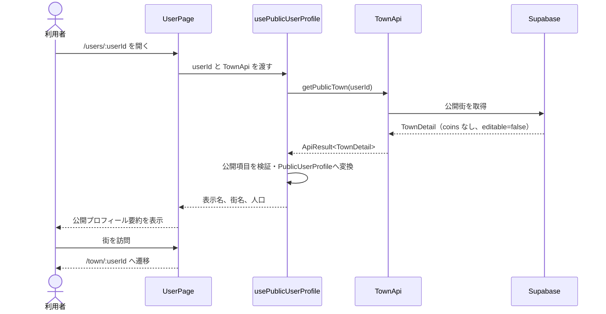
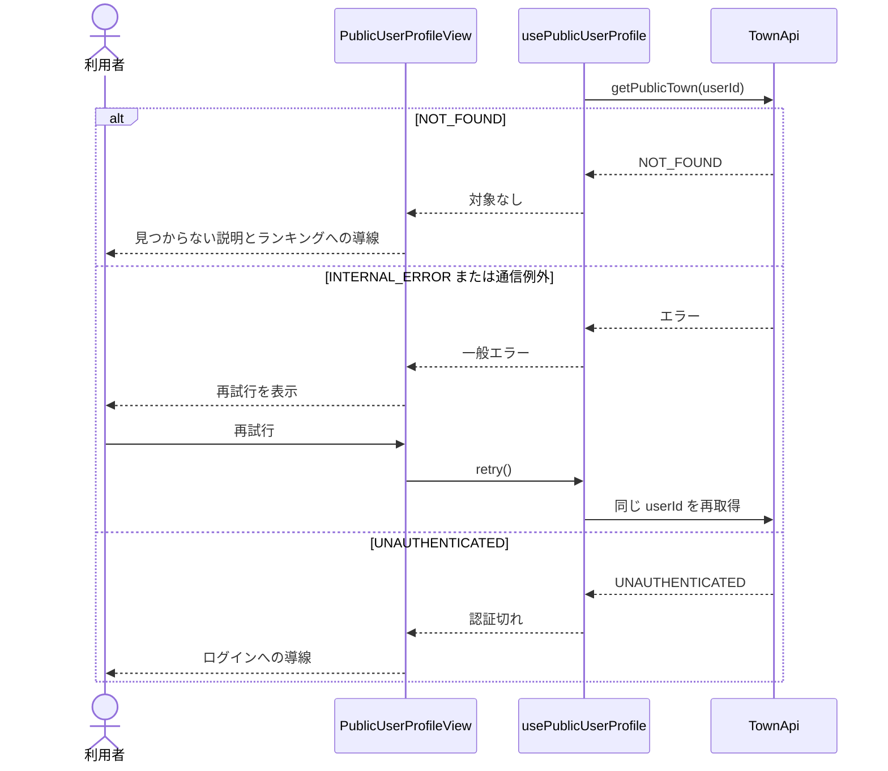

# ユーザーページ機能 計画書

| 項目 | 内容 |
|---|---|
| 対象プロダクト | Walk City |
| ステータス | In Progress（実装順6完了） |
| 作成日 | 2026-08-28 |
| 対象 | 他ユーザーの公開プロフィール要約、街への導線、読み込み・エラー状態 |
| 対象ルート | `/users/:userId` |
| 使用 API | `getPublicTown(userId)` |

## 1. 概要

ユーザーページは、ランキングで選択したユーザーの公開情報を確認し、そのユーザーの街へ移動するための画面である。

初期版では、既存の公開街 API `getPublicTown(userId)` から取得できる表示名、街名、人口だけを表示する。プロフィール専用 API や未確定のプロフィール項目をフロントエンドだけで作らない。公開街レスポンスに含めてはならないコイン、歩数、メールアドレス、Google Health 連携状態は、型変換時にも表示用モデルから除外する。

ランキングから `/users/:userId`、ユーザーページから `/town/:userId` へ遷移する既存の導線を完成させ、現在の準備中画面を実データ表示へ置き換える。

## 2. 前提と現状

### 2.1 参照する上位仕様

実装時は次の順で仕様を参照する。

1. API の型・関数・エラーコード: [API 設計書](./API計画書.md)
2. フロントエンドの責務: [フロントエンド設計書](./フロントエンド.md)
3. 配置、依存方向、ルーティング: [フロントエンド詳細技術設計書](./frontend-architecture.md)
4. 遷移元と公開項目: [ランキング機能 計画書](./ランキング機能DesignDoc.md)
5. 公開情報と認可: [バックエンド設計書](./バックエンド.md)、[システムアーキテクチャ](./architecture.md)

文書間に差異がある場合、API の入出力は `API計画書.md`、フロントエンドの担当範囲は `フロントエンド.md` を優先する。フロントエンドだけで新しい公開項目やゲームルールを決めない。

### 2.2 現在の実装状態

2026-08-28 時点で次の基盤は実装済みである。

- React 19、TypeScript、Vite、Tailwind CSS、React Router、Vitest、Testing Library
- 認証必須の `GameLayout` と `RequireAuth`
- `/ranking`、`/users/:userId`、`/town/:userId` のルート
- URL を生成する `paths.user(userId)` と `paths.town(userId)`
- ランキング項目から `/users/:userId` への遷移
- `TownApi.getPublicTown(userId)` と公開街のモック
- `ApiProvider` による `townApi` の提供
- `/town/:userId` での閲覧専用街表示

`src/app/routes/UserPage.tsx` は URL の `userId` を表示して街へのリンクを出す準備中画面であり、公開データの取得、ローディング、API エラー、再試行は未実装である。

## 3. 目的と非目的

### 3.1 目的

- `/users/:userId` で対象ユーザーの表示名、街名、人口を表示できる。
- ランキング項目から選択したユーザーの情報を取得できる。
- 「街を訪問」操作で `/town/:userId` へ遷移できる。
- 初期読み込み、取得成功、対象なし、通信失敗、認証切れを区別できる。
- 通信失敗時に同じ対象を再取得できる。
- URL の対象が変わったとき、直前のユーザー情報を新しい対象として表示しない。
- 公開対象外の情報をレスポンス、表示用モデル、DOM、エラー表示へ露出しない。
- モック API と将来の Supabase 実 API を同じ `TownApi` 契約で利用できる。
- PC とスマートフォン、キーボード操作、スクリーンリーダーで利用できる。

### 3.2 非目的

初期版では次を実装しない。

- プロフィールの編集
- 自己紹介、地域、称号、実績、フォロー数など、API に存在しない項目
- アバター画像の登録・変更
- フォロー、いいね、メッセージ、フレンド機能
- ユーザー検索やブロック
- 公開・非公開設定 UI
- 匿名ユーザーへの公開
- ユーザーページ内への街 Map の埋め込み
- コイン、歩数、最終同期日時、Google Health 連携状態の表示
- フロントエンドによる人口計算
- プロフィール専用 API の新設

街の全体表示は `/town/:userId` に集約する。ユーザーページは公開情報の要約と遷移に責務を限定する。

## 4. 用語

| 用語 | 定義 |
|---|---|
| 対象ユーザー | URL の `userId` で指定されたユーザー |
| 公開街 | `getPublicTown(userId)` が返す、`editable: false` かつ非公開項目を含まない街 |
| 公開プロフィール要約 | 公開街から抽出したユーザー ID、表示名、街 ID、街名、人口 |
| 現在ユーザー | Supabase セッションで認証中の本人 |
| 表示用モデル | UI が受け取る `PublicUserProfile`。`TownDetail` の全体を UI へ渡さない |

## 5. 仕様上の決定

### 5.1 初期版のデータソース

- 初期版は `TownApi.getPublicTown(userId)` を使用する。
- プロフィール専用 API は追加しない。
- `TownDetail.town.owner`、`TownDetail.town.name`、`TownDetail.town.population` を公開プロフィール要約へ変換する。
- API が返した表示名、街名、人口をそのまま正とし、別データとの結合や人口の再計算をしない。
- 将来、自己紹介やアバターなどの正式な公開項目が決まった場合に限り、`getPublicUser(userId)` などの専用 API を API 設計書へ追加して移行する。

この方針により、現行 API だけでフロントエンドを実装できる。一方で、街を持たないユーザーをプロフィールだけ表示する要件が将来追加された場合は、`getPublicTown` では表現できないため専用 API が必要になる。

### 5.2 公開する項目

| 項目 | 表示 | データ元 | 備考 |
|---|---|---|---|
| 表示名 | 必須 | `town.owner.displayName` | 長い場合は折り返す |
| ユーザー ID | 非表示 | URL / `town.owner.id` | 取得対象の整合性確認にのみ使用 |
| 街名 | 必須 | `town.name` | 空文字は API 契約違反として一般エラー扱い |
| 人口 | 必須 | `town.population` | `ja-JP` で桁区切りし「人」を付ける |
| 街 ID | 非表示 | `town.id` | 初期 UI では使用しない |
| アバター |代替表示 | 表示名の先頭1文字 | 画像 URL が契約にないため画像は作らない |

次の情報は表示せず、`PublicUserProfile` にも含めない。

- `town.coins`
- 今日の歩数、過去の歩数、最終同期日時
- Google Health の接続・権限状態
- メールアドレス
- OAuth や Supabase のトークン
- 内部エラー詳細、SQL、スタックトレース

### 5.3 自分自身のユーザーページ

ランキングの自分の行から `/users/:currentUserId` を開いた場合も、他ユーザーと同じ公開プロフィール要約を表示する。公開範囲の確認にもなるため、ユーザーページから即座に `/` へリダイレクトしない。

「街を訪問」は既存仕様どおり `/town/:userId` を生成する。対象が本人の場合は `TownPage` が `/` へ `replace` 遷移し、編集可能画面を一つに統一する。

### 5.4 URL パラメータ

- リンクは必ず `paths.user(userId)`、`paths.town(userId)` で生成する。
- `userId` を URL 文字列へ手作業で連結しない。
- 空または空白だけの `userId` は取得せず、不正な URL としてランキングへの戻り導線を表示する。
- 初期版はフロントエンドで UUID 形式へ固定しない。モック ID と将来の API 契約を許容し、最終検証は API に委ねる。
- URL 上の `userId` とレスポンスの `town.owner.id` が一致しない場合は契約違反として一般エラーにし、別ユーザーのデータを表示しない。

### 5.5 データ鮮度

- `/users/:userId` へ入るたびに取得する。
- 自動ポーリングとリアルタイム購読は行わない。
- 一般エラー時は「再試行」で同じ `userId` を再取得する。
- `userId` の変更時は既存データを直ちに破棄し、新しい対象のスケルトンを表示する。
- アンマウント後または新しいリクエスト開始後に完了した古いレスポンスは無視する。

## 6. 画面 UI

### 6.1 画面構成

`GameLayout` の共通ヘッダー内に、次の順で配置する。

1. 「ランキングへ戻る」リンク
2. 表示名の先頭文字を使った代替アバター
3. 表示名
4. 「公開プロフィール」の補助ラベル
5. 街の要約カード
   - 街名
   - 人口
6. 主操作「このユーザーの街を訪問」

内部 `userId` は画面へ表示しない。ユーザーページ内に Map、ショップ、編集操作は表示しない。

### 6.2 レスポンシブ表示

- コンテンツ最大幅は既存 `GameLayout` に合わせ、読みやすい1カラムとする。
- 320 px 幅でも横スクロールを発生させない。
- 長い表示名と街名はカード幅で折り返し、CTA を押し出さない。
- 人口は `tabular-nums` を使用し、数値と単位を分離しすぎない。
- タップ対象は最小 44×44 px を確保する。

### 6.3 画面状態

| 状態 | 条件 | 表示 | 操作 |
|---|---|---|---|
| 初期読み込み | 最初の取得中 | プロフィールと街カードのスケルトン | 二重取得しない |
| 成功 | 公開プロフィール要約を取得 | 表示名、街名、人口、街への CTA | 街を訪問、ランキングへ戻る |
| 不正な URL | `userId` が空 | 対象を特定できない説明 | ランキングへ戻る |
| 対象なし | `NOT_FOUND` | ユーザーまたは公開街が見つからない説明 | ランキングへ戻る |
| 認証切れ | `UNAUTHENTICATED` | 再ログインが必要な説明 | ログインへ移動 |
| 通信・内部失敗 | `INTERNAL_ERROR` または例外 | 一般メッセージ | 再試行、ランキングへ戻る |

`NOT_FOUND` では「ユーザーが存在しない」と「非公開である」を区別しない。将来公開設定が追加されても存在確認に悪用されない文言にする。

### 6.4 アクセシビリティ

- ページの主見出しは表示名を含む一つの `h1` とする。
- 戻るリンクと街への CTA は実際の `Link` とし、クリック可能な `div` を使わない。
- 初期読み込みは `aria-busy="true"` と支援技術向け文言で伝える。
- API エラーは `role="alert"`、再試行中の更新は `aria-live="polite"` で通知する。
- 代替アバターは装飾扱いにし、表示名を重複読み上げしない。
- フォーカスリングを消さず、色だけで状態を表現しない。
- スケルトンのアニメーションは `prefers-reduced-motion` で停止できるようにする。

## 7. ルーティングと遷移

### 7.1 ルート

| Path | Page | 認証 | 役割 |
|---|---|---|---|
| `/ranking` | `RankingPage` | 必須 | ユーザーの選択元 |
| `/users/:userId` | `UserPage` | 必須 | 公開プロフィール要約 |
| `/town/:userId` | `TownPage` | 必須 | 対象ユーザーの街を閲覧 |
| `/` | `TownPage` | 必須 | 自分の街を表示・編集 |

既存の `RequireAuth` と `GameLayout` を継続利用し、`UserPage` 内でセッション取得を重複実行しない。

### 7.2 遷移フロー

```text
/ranking
  ↓ ランキング項目を選択
/users/:userId
  ├─ 街を訪問 → /town/:userId
  │                 └─ 本人なら / へ replace
  └─ 戻る       → /ranking
```

ブラウザの戻る・進む、URL 直接入力、リロードでも同じ状態を復元できるよう、対象ユーザーはコンポーネント状態ではなく URL を正とする。

## 8. フロントエンドデータ契約

### 8.1 既存 API 契約

```ts
interface TownApi {
  getPublicTown(userId: string): Promise<ApiResult<TownDetail>>
}
```

`getPublicTown` の成功レスポンスは次を満たす。

- `town.owner.id` が要求した `userId` と一致する。
- `town.coins` を含まない。
- `editable` は `false` である。
- `town.population` はサーバー計算済みの非負整数である。

### 8.2 表示用モデル

```ts
type PublicUserProfile = {
  id: string
  displayName: string
  town: {
    id: string
    name: string
    population: number
  }
}
```

`TownDetail` から `PublicUserProfile` への変換を純粋関数に分離する。コンポーネントへ `TownDetail` 全体を渡さないことで、コインなどの非公開項目を誤って追加表示するリスクを減らす。

### 8.3 変換時の検証

変換関数は次を検証する。

- 要求した `userId` と `town.owner.id` が一致する。
- `editable === false` である。
- 表示名と街名が空文字ではない。
- 人口が有限の非負整数である。

契約違反時は生データを表示せず、`INTERNAL_ERROR` 相当の一般メッセージへ正規化する。内部値は画面や本番ログへ出さない。

### 8.4 Hook の公開形

```ts
type PublicUserProfileState = {
  profile: PublicUserProfile | null
  isLoading: boolean
  error: ApiError | null
  retry: () => Promise<void>
}

function usePublicUserProfile(
  api: Pick<TownApi, 'getPublicTown'>,
  userId: string,
): PublicUserProfileState
```

Hook はデータ取得、例外の正規化、古いレスポンスの破棄、再試行、表示用モデルへの変換を担当する。Page と表示コンポーネントは `TownApi` の呼び出しや `TownDetail` の解析を行わない。

## 9. コンポーネント設計

| Component / Page | 責務 |
|---|---|
| `UserPage` | URL パラメータの解釈、`townApi` の受け渡し、遷移先生成 |
| `PublicUserProfileView` | Hook と画面状態の結合 |
| `UserProfileSummary` | 取得済みの表示名、街名、人口、CTA の表示 |
| `UserProfileSkeleton` | 初期読み込み中のレイアウト維持 |
| `UserProfileErrorState` | 不正 URL、対象なし、認証切れ、一般失敗の案内と操作 |

`UserProfileSummary` はデータ取得を行わず、`PublicUserProfile` とリンク先を Props で受け取る。ユーザー機能固有のスタイルは Tailwind CSS のユーティリティで実装し、ページ専用 CSS は追加しない。

## 10. ディレクトリと変更予定ファイル

```text
frontend/src/
├── app/
│   ├── routes/
│   │   └── UserPage.tsx                 # 準備中画面を置換
│   ├── paths.ts                         # 既存ヘルパーを継続利用
│   └── router.test.tsx                  # ルート統合テストを更新
├── features/
│   └── user/
│       ├── components/
│       │   ├── PublicUserProfileView.tsx
│       │   ├── UserProfileSummary.tsx
│       │   ├── UserProfileSkeleton.tsx
│       │   ├── UserProfileErrorState.tsx
│       │   └── index.ts
│       ├── hooks/
│       │   ├── usePublicUserProfile.ts
│       │   ├── usePublicUserProfile.test.ts
│       │   └── index.ts
│       └── types.ts
└── mocks/
    ├── data/
    │   └── towns.ts                     # 既存公開街を流用・不足ケースを追加
    └── services/
        └── town.ts                      # 既存失敗注入を流用
```

`features/user/api/` とプロフィール専用モックサービスは作らない。初期版の通信契約は既存 `TownApi` が所有しているためである。将来 `getPublicUser` を追加するときに、`features/user/api/` と実 API・モック API を同時に追加する。

## 11. 状態管理と競合防止

状態は次の最小モデルとする。

```ts
type PublicUserProfileQueryState =
  | { status: 'loading'; profile: null; error: null }
  | { status: 'success'; profile: PublicUserProfile; error: null }
  | { status: 'error'; profile: null; error: ApiError }
```

- `userId` が変わったら `loading` へ戻し、前の `profile` を保持しない。
- リクエストごとに generation または active flag を持ち、古い応答を無視する。
- 同一 Hook インスタンスの再試行中は二重リクエストを開始しない。
- 失敗時に前のユーザー情報を残さない。
- 専用キャッシュライブラリは導入しない。
- 将来キャッシュを導入する場合の概念キーは `['user', 'public', userId]` とする。

## 12. 処理フロー

### 12.1 正常系



### 12.2 失敗と再試行



## 13. エラー処理

| API エラー | UI 方針 | 主操作 |
|---|---|---|
| `INVALID_INPUT` | 対象を特定できない安全な文言 | ランキングへ戻る |
| `NOT_FOUND` | ユーザーまたは公開街が見つからない文言 | ランキングへ戻る |
| `UNAUTHENTICATED` | セッション切れの文言 | ログインへ移動 |
| `INTERNAL_ERROR` | 詳細を伏せた一般メッセージ | 再試行 |
| 想定外のコード | 一般メッセージへフォールバック | 再試行 |
| Promise reject | `INTERNAL_ERROR` へ正規化 | 再試行 |

API の `message` を無条件に表示せず、安定した `code` に応じたユーザー向け文言を基本とする。SQL、内部 ID、スタック、トークン、レスポンス全体を DOM やコンソールへ出さない。

## 14. モック計画

既存 `createMockTownApi` と `MOCK_PUBLIC_TOWN` を流用し、少なくとも次を再現する。

- 通常の公開ユーザー
- 日本語・英数字を含む長い表示名と街名
- 人口 0
- 大きな人口値
- `NOT_FOUND`
- `UNAUTHENTICATED`
- `INTERNAL_ERROR`
- 疑似遅延中に別 `userId` へ遷移するケース
- API が例外を投げるケース
- 所有者 ID 不一致、`editable: true`、不正人口などの契約違反

モックデータは本番 UI から直接 import しない。`UserPage` は `ApiProvider` から取得した `townApi` だけを使用する。

## 15. セキュリティとプライバシー

- `/users/:userId` は初期版では認証必須とする。
- 「公開」は認証済みユーザー間で公開可能な情報を意味し、匿名公開を意味しない。
- RLS またはバックエンド API が公開可否と取得範囲を保証する。
- フロントエンドのルートガードを認可の根拠にしない。
- 公開街 API は `coins`、歩数、メール、Health 情報を返さない。
- UI は `TownDetail` を表示用モデルへ絞り込み、防御的に非公開項目を捨てる。
- `NOT_FOUND` の文言で、未登録と非公開の違いを明かさない。
- URL の `userId` を更新 API、所有者指定、認可判定に使用しない。

## 16. テスト計画

### 16.1 単体テスト

- 正常な `TownDetail` を `PublicUserProfile` へ変換できる。
- `coins`、建物、歩数相当の値が表示用モデルに入らない。
- 要求 ID と所有者 ID の不一致を拒否する。
- `editable: true`、空の表示名・街名、負数・小数・非有限人口を拒否する。
- 表示名の先頭文字を日本語と英数字から安全に取得できる。
- 人口を `ja-JP` 形式で表示できる。

### 16.2 Hook テスト

- 初回に `getPublicTown(userId)` を1回呼ぶ。
- 成功時に表示用モデルを返す。
- `NOT_FOUND`、`UNAUTHENTICATED`、`INTERNAL_ERROR` を保持する。
- Promise reject を一般エラーへ正規化する。
- 再試行で同じ `userId` を再取得する。
- `userId` 変更時に前のプロフィールを消す。
- 遅い古い応答で新しいユーザーを上書きしない。
- アンマウント後に状態更新しない。

### 16.3 コンポーネントテスト

- 読み込み中にスケルトンと支援技術向け文言を表示する。
- 成功時に表示名、街名、人口を表示する。
- ユーザー ID、コイン、歩数、メール、Health 情報を表示しない。
- 街へのリンクが `paths.town(userId)` を指す。
- `NOT_FOUND` でランキングへのリンクを表示する。
- 一般エラーで再試行ボタンを表示する。
- 長い表示名と街名でも操作要素が利用できる。

### 16.4 ルーター統合テスト

- 認証済みユーザーがランキングから実ユーザーページへ遷移できる。
- 未認証で `/users/:userId` を開くと `/login` へ誘導される。
- URL 直接入力とリロードで同じ対象を取得する。
- 「街を訪問」で対象の `/town/:userId` を表示する。
- 自分の街への遷移は最終的に `/` の編集画面へ統一される。
- 存在しない対象でも URL を維持してページ内エラーを表示する。

### 16.5 API 契約テスト

- モックと実 API が同じ `TownApi.getPublicTown` シグネチャを満たす。
- 公開レスポンスに `town.coins` がない。
- 公開レスポンスの `editable` が `false` である。
- 存在しないまたは非公開の対象が `NOT_FOUND` になる。
- 他ユーザーのメール、歩数、Health 情報がレスポンスに含まれない。

### 16.6 手動確認

- PC と 320 px 幅のスマートフォンで横スクロールなく表示できる。
- キーボードだけで戻る、再試行、街への遷移を操作できる。
- スクリーンリーダーで見出し、読み込み、エラー、リンク目的を理解できる。
- 低速モックでスケルトンと二重取得防止を確認できる。
- 長い日本語名、英数字名、人口 0、大きな人口を確認できる。
- ブラウザの戻る・進むで別ユーザーの情報が一瞬混ざらない。

## 17. 実装順序

1. **完了:** `PublicUserProfile` と `TownDetail` からの安全な変換関数を定義し、単体テストを作る。
2. **完了:** `usePublicUserProfile` を実装し、成功、エラー、再試行、競合防止を Hook テストする。
3. **完了:** 既存モックへ不足シナリオと契約違反ケースを追加する。
4. **完了:** スケルトン、要約、エラー状態の表示コンポーネントを実装する。
5. **完了:** `UserPage` の準備中 UI を `PublicUserProfileView` に置き換え、`ApiProvider` の `townApi` を接続する。
6. **完了:** ランキングからユーザーページ、ユーザーページから街までのルーター統合テストを更新する。
7. lint、型チェック、build、全テストを実行する。
8. PC、スマートフォン、キーボード、低速・失敗シナリオを手動確認する。
9. Supabase の `getPublicTown` 実装が利用可能になった時点で同じ契約テストを実 API アダプターにも適用する。

バックエンドが未完成でも、手順1〜8は既存の `TownApi` とモックで完了できる。実 API 接続時に Page やコンポーネントを変更せず、Provider が供給する実装だけを差し替える。

## 18. 完了条件

- `/users/:userId` の準備中表示が公開プロフィール要約へ置き換わっている。
- 表示名、街名、人口が API レスポンスどおりに表示される。
- 「街を訪問」で正しい `/town/:userId` へ遷移できる。
- 初期読み込み、不正 URL、対象なし、認証切れ、通信失敗、再試行を処理できる。
- URL の対象変更時に前のユーザー情報が表示されない。
- コンポーネントが Supabase SDK、モックデータ、`TownDetail` 全体を直接参照しない。
- コイン、歩数、メール、Health 情報、内部エラー詳細が表示用モデルと DOM に含まれない。
- モックと実 API が同じ `TownApi` 契約を満たす。
- 単体、Hook、コンポーネント、ルーター統合、API 契約テストが成功する。
- lint、型チェック、build が成功する。
- PC とスマートフォンの手動確認が完了している。

## 19. リスクと対策

| リスク | 影響 | 対策 |
|---|---|---|
| プロフィール専用 API がない | 表示できる項目が少ない | 初期版は公開街の確定項目に限定し、項目追加時に API 文書から更新する |
| 公開街レスポンスへ誤って非公開値が混入 | プライバシー情報の露出 | バックエンド契約テストに加え、表示用モデルで許可項目だけを抽出する |
| URL 切り替え時の古い応答 | 別ユーザー情報の誤表示 | `userId` 変更時にデータを破棄し、generation で古い応答を無視する |
| `NOT_FOUND` が存在確認に使われる | 非公開状態の推測 | 未登録と非公開を区別しない文言・同じエラーコードにする |
| 長い表示名・街名 | レイアウト崩れ | 折り返し、320 px 幅、長文モックで検証する |
| 本人の `/town/:userId` への余分な遷移 | 一瞬の表示切り替え | 既存 `TownPage` の `replace` を維持し、必要なら将来 CTA だけ `/` へ最適化する |

## 20. 合意事項と後続決定事項

### 20.1 本実装で固定する事項

- `/users/:userId` は認証必須とする。
- 初期版は `getPublicTown(userId)` を使用する。
- 表示項目は表示名、街名、人口に限定する。
- ユーザー ID と街 ID は UI に表示しない。
- コイン、歩数、メール、Health 情報を表示用モデルに含めない。
- ユーザーページ内に Map を埋め込まず、`/town/:userId` へのリンクを提供する。
- 本人のユーザーページも公開表示として閲覧できる。
- 対象なしと非公開は同じ安全な文言で扱う。

### 20.2 バックエンド・企画と後続で決める事項

- アバター URL、自己紹介、称号、実績など追加プロフィール項目の要否
- 街を持たないユーザーを表示するか
- プロフィール専用 `getPublicUser(userId)` API の要否
- ユーザー単位または街単位の公開・非公開設定
- 匿名閲覧の要否と、その場合の RLS・ルートガード変更
- アカウント削除・利用停止ユーザーの表示文言

これらが決まるまでは、フロントエンドの仮データや固定文言で項目を追加しない。

## 21. 関連文書

- [フロントエンド設計書](./フロントエンド.md)
- [フロントエンド詳細技術設計書](./frontend-architecture.md)
- [API 設計書](./API計画書.md)
- [ランキング機能 計画書](./ランキング機能DesignDoc.md)
- [Map 機能 計画書](./map機能DesignDoc.md)
- [バックエンド設計書](./バックエンド.md)
- [システムアーキテクチャ](./architecture.md)
