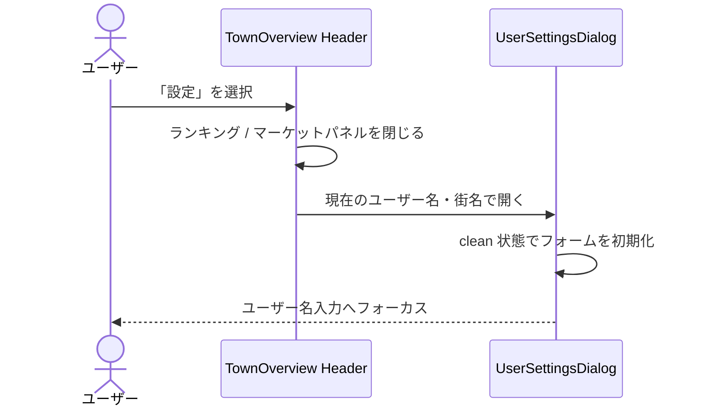
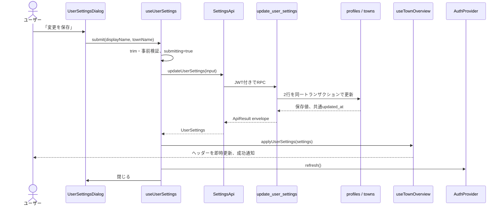
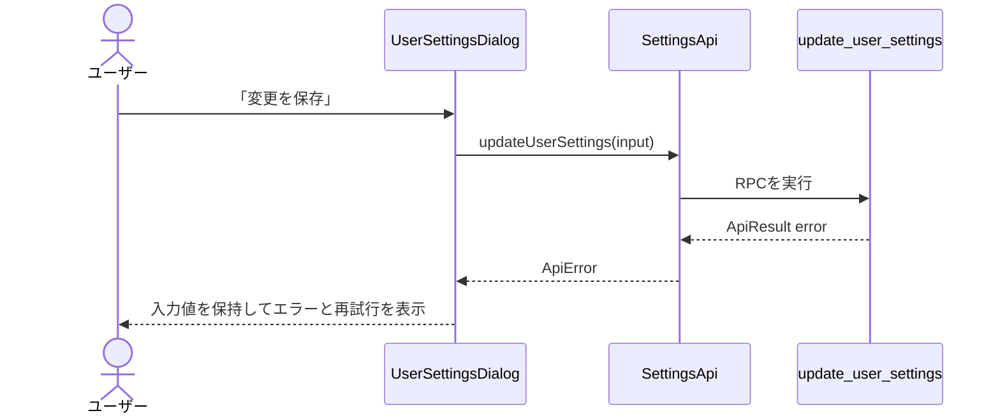

# ユーザー名・街名設定機能 設計書兼実装計画書

| 項目 | 内容 |
| --- | --- |
| 対象プロダクト | Walk City |
| ステータス | Phase 1 Complete（契約確定・実装未着手） |
| 作成日 | 2026-08-30 |
| 契約確定日 | 2026-08-30 |
| 対象機能 | 公開ユーザー名と街名の変更、設定ボタン、設定モーダル |
| 対象画面 | 自分の街（`/`） |
| 関連データ | `profiles.display_name`、`towns.name` |
| 新規 API | `updateUserSettings(input)` / Supabase RPC `update_user_settings` |

## 1. 概要

自分の街のヘッダーに「設定」ボタンを追加し、公開ユーザー名と街名を同じモーダルから変更できるようにする。

設定ボタンは「ランキング」ボタンの左へ配置し、自分の街を表示しているときだけ表示する。他ユーザーの公開街では、閲覧者が所有者の名前を変更できるように見える導線を出さない。

保存時は、認証済み JWT からユーザーを特定し、`profiles.display_name` と、そのユーザーが所有する `towns.name` を1回の Supabase RPC で更新する。2項目は同一トランザクションで扱い、片方だけ更新された状態を作らない。フロントエンドは成功レスポンスを現在表示中の街へ反映し、街全体の再取得を待たずにヘッダーを更新する。

本書は、既存の [ランキング機能 計画書](./ランキング機能DesignDoc.md)、[Map 機能 計画書](./map機能DesignDoc.md)、[建物詳細・表示名変更 API 設計書](./建物詳細・表示名変更API設計書.md)、[フロントエンド詳細技術設計書](./frontend-architecture.md)、[Supabase バックエンド実装計画書](./Supabaseバックエンド実装計画書.md) と同じく、画面、API、データ、モック、テスト、担当分担、実装順序、完了条件を一つにまとめる。

## 2. 背景と現在の実装

### 2.1 フロントエンドの現状

2026-08-30 時点で、次の基盤が実装済みである。

- React 19、TypeScript、Vite、Tailwind CSS、React Router、Vitest、Testing Library
- 認証必須の自分の街ルート `/` と、公開街ルート `/town/:userId`
- `TownOverview` 内のユーザーダッシュボードヘッダー
- ヘッダー上の「ランキング」「マーケット」ボタンと右側パネル
- `TownApi.getMyTown()` による `TownDetail` の取得
- `ApiProvider` による mock / Supabase API の切り替え
- 自分の街、ランキング、公開街が共有する公開ユーザー名と街名の表示
- `MockWalkCityStore` による自分の街、歩数、コインの共有 mock 状態

現在のヘッダーでは、ユーザー情報カードの右側に「ランキング」ボタンがあり、設定導線は存在しない。`TownOverview` のパネル状態は `ranking | market | null` であり、設定は右側パネルではなく独立したモーダルとして追加する。

### 2.2 バックエンドの現状

- 公開ユーザー名は `profiles.display_name` に保存される。
- 街名は `towns.name` に保存される。
- `profiles.id` と `towns.owner_id` は認証ユーザー ID によって関連付けられる。
- 認証済みユーザーには `profiles.display_name` の直接更新権限と本人更新用 RLS が存在する。
- `towns.name` のブラウザからの直接更新権限は付与されていない。
- 両列とも `text not null` だが、名前の長さ、前後空白、制御文字に関する DB 制約は未定義である。
- `my_town_details_view`、`public_town_details_view`、`population_ranking_view` は、いずれも上記の名前を読み取り元にする。

既存の [API 設計書](./API計画書.md) と [バックエンド設計書](./バックエンド.md) には「MVPではプロフィール表示名と街名の変更 API / UI を実装しない」と記載されている。本機能はその後に追加された要件であるため、本書を今回の機能に関する優先仕様とし、実装と同じ変更で既存2文書の該当記述を更新する。

## 3. 用語

| 用語 | 定義 |
| --- | --- |
| 公開ユーザー名 | `profiles.display_name`。ランキング、自分の街、公開街などで他ユーザーにも表示する名前 |
| 街名 | `towns.name`。既存文書と UI の表記に合わせ、「町名」ではなく「街名」と表記する |
| 設定値 | 設定モーダルで編集する公開ユーザー名と街名の組 |
| dirty | モーダルの入力値が、モーダルを開いた時点の保存済み値と異なる状態 |
| 原子的更新 | 2項目が両方成功するか、両方とも変更されない更新 |
| canonical value | DB に保存され、公開表示で正とする値 |

## 4. 目的と非目的

### 4.1 目的

- 自分の街のヘッダーで、ランキングボタンの左に設定ボタンを表示する。
- 設定ボタンから、公開ユーザー名と街名を編集するモーダルを開ける。
- 現在値を入力欄の初期値として表示する。
- 2項目を同じ保存操作で原子的に更新する。
- 成功後、ヘッダーのユーザー名、頭文字、街名を即座に更新する。
- 設定後にランキングを開き直すと、現在ユーザー行へ新しい名前が反映される。
- 設定後に公開街を再取得すると、新しい名前が反映される。
- mock と Supabase が同じ `SettingsApi` 契約を実装する。
- 不正入力、認証切れ、通信失敗を区別し、入力値を失わず再試行できる。
- PC、スマートフォン、キーボード、スクリーンリーダーで操作できる。

### 4.2 非目的

初期リリースでは次を実装しない。

- メールアドレス、Google アカウント名、アバター、自己紹介の変更
- ユーザー ID、街 ID、地図サイズ、人口、コインの変更
- アカウント削除、ログアウト、Google Health 設定
- 公開 / 非公開設定
- ユーザー名または街名の一意性保証
- 予約語、NG ワード、なりすまし、類似文字の自動検出
- 名前の変更履歴、変更回数制限、クールダウン
- ほかのユーザーの街からの設定変更
- Realtime による別タブ、ランキング、公開街の自動同期
- 保存前のサーバー側利用可能性チェック

## 5. 仕様上の決定

### 5.1 Phase 1 合意事項

2026-08-30 に、フロントエンド・バックエンド実装の前提となる次の5項目を正式決定した。以降の Phase では、仕様変更として再合意しない限り、この内容を固定契約として扱う。

| 項目 | 決定内容 |
| --- | --- |
| 名前の上限 | 公開ユーザー名、街名ともに正規化後1〜30 Unicode文字とする |
| 名前の重複 | ユーザー間の同名、街間の同名、ユーザー名と街名の同名をすべて許可する |
| 保存単位 | 2項目を常に同じ API 呼び出し・同じトランザクションでまとめて保存する |
| 正式なユーザー名 | `profiles.display_name` をログイン後の全画面で使用する canonical value とする |
| 更新経路 | `profiles` のブラウザからの直接更新権限を廃止し、本人確認を行う RPC へ完全に一本化する |

この決定により、ユーザー名だけ、または街名だけを保存する個別 API は作らない。画面上で片方だけを編集した場合も、もう片方の保存済み現在値を含めて2項目を送信する。

### 5.2 保存単位

- 公開ユーザー名と街名は、1つの `updateUserSettings()` で同時に送信する。
- バックエンドは1つのトランザクションで2行を更新する。
- 片方だけ変更した場合も、もう片方の現在値を含む完全な設定値を送る。
- 2項目のどちらかが不正なら、どちらも更新しない。
- 同じ値の再送で人口、コイン、台帳などの累積変更は起きないため、初期版では `requestId` を設けない。
- 同時編集は last-write-wins とする。初期版では `expectedUpdatedAt` による楽観的ロックを設けない。

### 5.3 名前のルール

公開ユーザー名と街名には同じ規則を適用する。

- 前後の ASCII space（U+0020）は保存前に除去する。タブや改行は trim せず、不正な制御文字として拒否する。
- 正規化後、1〜30 Unicode 文字とする。
- 空文字と空白だけの値を拒否する。
- 改行、タブ、NULL 文字、DEL、その他の制御文字を拒否する。
- 文字列内の通常の空白、日本語、英数字、一般的な記号、絵文字を許可する。
- Unicode の大文字小文字変換や NFC / NFKC 変換は行わず、入力文字を保持する。
- 同じ公開ユーザー名、同じ街名、ユーザー名と街名が同じ値であることを許可する。
- HTML や Markdown として解釈せず、常にプレーンテキストとして表示する。
- フロントエンドでも同じ規則で事前検証するが、最終判定はバックエンドと DB 制約を正とする。

JavaScript 側の文字数は `Array.from(normalized).length`、PostgreSQL 側は `char_length(normalized)` を使用する。絵文字を含む特殊な結合文字では見た目の文字数と一致しない場合があるが、初期版では grapheme cluster 単位の計数を行わない。

### 5.4 公開範囲と反映先

両方の名前は公開情報であり、変更後は次へ反映される。

| 表示先 | 反映方法 |
| --- | --- |
| 現在表示中の自分の街ヘッダー | 保存成功レスポンスでローカルの `TownDetail` を更新 |
| 現在表示中の頭文字 | 更新後の公開ユーザー名の先頭文字から再計算 |
| ランキング | 次回の初回取得または更新で View から取得。設定直後にランキングを開く場合は新しい値を取得 |
| 公開街 | 次回の `getPublicTown()` 取得で View から取得 |
| ユーザーページ | 次回の公開街取得で取得 |
| 認証済みユーザーメニュー | `AuthProvider.refresh()` 後に `profiles.display_name` を反映 |

設定保存によって既に別画面に表示中のキャッシュを全て探索して書き換えない。API 再取得を境界とし、必要に応じて将来キャッシュライブラリ導入時に invalidation へ置き換える。

## 6. 画面設計

### 6.1 設定ボタンの配置

自分の街のヘッダーを次の順序にする。

```text
┌──────────────────────────────────────────────────────────────┐
│ [ユーザー情報] [⚙ 設定] [♛ ランキング] [◇ マーケット] ... │
└──────────────────────────────────────────────────────────────┘
```

- 「設定」はユーザー情報カードの直後、ランキングボタンの直前に置く。
- `mode.type === 'self'` のときだけ表示する。
- `mode.type === 'public'` では表示しない。
- 既存ボタンと同じ最小高さ `58px`、角丸、フォーカス表示、横スクロール内の固定幅を使用する。
- 歯車アイコンには `aria-hidden="true"` を設定し、ボタンのアクセシブル名は「設定」とする。
- モーダル表示中は `aria-expanded="true"` と `aria-controls="user-settings-dialog"` を設定する。
- 設定を開くとランキング / マーケットの右側パネルを閉じる。配置、移動、土地開放、道路配置の作業状態は破棄せず、モーダルを閉じた後に再開できる。

### 6.2 設定モーダル

```text
┌─────────────────────────────────────────┐
│ 設定                              [×]  │
│ 公開プロフィールと街の名前を変更できます │
│                                         │
│ ユーザー名                              │
│ [ Walk City ユーザー_______________ ]  │
│ 30文字以内・ランキング等に公開されます   │
│                                         │
│ 街の名前                                │
│ [ グリーンタウン____________________ ]  │
│ 30文字以内・街とランキングに公開されます │
│                                         │
│ [キャンセル]              [変更を保存]  │
└─────────────────────────────────────────┘
```

- 見出しは「設定」とする。
- 入力ラベルは「ユーザー名」「街の名前」とする。
- 入力値は現在表示中の `TownDetail.town.owner.displayName` と `TownDetail.town.name` で初期化する。
- 公開情報であることを各入力欄の補足またはモーダルの説明で明示する。
- 入力中は現在文字数を表示し、上限超過と制御文字を入力欄ごとに示す。
- 値に変更がない場合、入力が不正な場合、保存中の場合は「変更を保存」を無効化する。
- Enter による form submit を許可する。保存中の二重送信を防ぐ。
- 保存成功時はモーダルを閉じ、ヘッダー上部に「設定を保存しました」の `role="status"` 通知を表示する。
- 保存失敗時はモーダルを開いたままにし、入力値を保持する。
- 「キャンセル」、閉じるボタン、Escape は保存中でなければモーダルを閉じ、未保存値を破棄する。
- 誤操作を避けるため、背景クリックだけでは閉じない。
- 保存中は入力欄、キャンセル、閉じる、保存を無効化し、保存ボタンを「保存中…」にする。

### 6.3 レスポンシブ表示

| 項目 | PC | スマートフォン |
| --- | --- | --- |
| モーダル幅 | 最大 520px、画面中央 | 左右 16px を確保し、ほぼ全幅 |
| 入力欄 | 縦に2項目 | 同じく縦に2項目 |
| 操作ボタン | 右寄せ、キャンセル→保存 | 2列または縦並び。320px で文字が欠けないこと |
| 高さ | 内容に応じる | `max-height` と内部スクロールを持ち、ソフトキーボード表示時にも操作可能 |

### 6.4 アクセシビリティ

- `role="dialog"` と `aria-modal="true"` を使用する。
- `aria-labelledby` で見出し、`aria-describedby` で公開情報の説明へ関連付ける。
- 開いた直後は「ユーザー名」入力へフォーカスする。
- Tab / Shift+Tab のフォーカスをモーダル内に閉じ込める。
- 閉じた後は設定ボタンへフォーカスを戻す。
- 背景コンテンツを操作・読み上げ対象にしない。
- 入力エラーを `aria-invalid`、`aria-describedby` とテキストで示し、色だけに依存しない。
- API エラーは `role="alert"`、保存成功は既存通知領域の `role="status"` で通知する。
- `prefers-reduced-motion` ではモーダルの拡大・移動アニメーションを抑制する。

## 7. 画面状態

| 状態 | 表示 | 許可する操作 |
| --- | --- | --- |
| `closed` | 設定ボタンのみ | モーダルを開く |
| `editing-clean` | 現在値、保存無効 | 入力、キャンセル、閉じる |
| `editing-dirty-valid` | 変更値、保存有効 | 入力、保存、キャンセル、閉じる |
| `editing-invalid` | 項目ごとのエラー、保存無効 | 入力、キャンセル、閉じる |
| `submitting` | 「保存中…」、全操作無効 | 完了を待つ |
| `submit-error` | 入力値と API エラーを保持 | 修正、再保存、キャンセル、閉じる |
| `success` | モーダルを閉じ、成功通知 | 通常操作 |

保存レスポンスが返る前にコンポーネントが破棄された場合、state を更新しない。通信手段が中断をサポートする場合は `AbortController`、Supabase RPC の中断が難しい場合はリクエスト世代番号で古い結果を無視する。

## 8. フロントエンド API 契約

### 8.1 型

```ts
type UpdateUserSettingsInput = {
  displayName: string
  townName: string
}

type UserSettings = {
  displayName: string
  townName: string
  updatedAt: string
}

interface SettingsApi {
  updateUserSettings(
    input: UpdateUserSettingsInput,
  ): Promise<ApiResult<UserSettings>>
}
```

- UI と Hook は `SettingsApi` にだけ依存する。
- ユーザー ID、街 ID、メール、人口、コインを入力に含めない。
- `updatedAt` はサーバーが生成した ISO 8601 形式の時刻とする。
- 2行の `updated_at` へ同じ値を設定し、その値を `updatedAt` として返す。
- `displayName` と `townName` は、バックエンドで trim された保存済み値を返す。
- Supabase の snake_case は Service 内で camelCase へ変換する。
- 不正なレスポンスは `INTERNAL_ERROR` へ正規化し、部分的な値を UI へ渡さない。

### 8.2 API を分離する理由

`TownApi` へ追加する案もあるが、ユーザー名は街ではなくプロフィールの責務であり、1回の更新が `profiles` と `towns` をまたぐ。本機能では `features/settings` と `SettingsApi` を新設し、建物配置や土地開放を扱う `TownApi` を肥大化させない。

### 8.3 エラー

既存の `ApiErrorCode` を再利用し、新しいコードは追加しない。

| code | 条件 | UI 方針 |
| --- | --- | --- |
| `UNAUTHENTICATED` | JWT がない、期限切れ | 入力を保持し、「再ログイン」導線を表示 |
| `INVALID_INPUT` | 名前の長さ、空白、制御文字、引数形式が不正 | 一般エラーを表示。項目別の事前検証も併用 |
| `NOT_FOUND` | 初期化未完了で profile または town がない | 設定を更新できない旨と再読み込み / 再ログインを案内 |
| `INTERNAL_ERROR` | DB 障害、未知の応答 | 入力を保持し、安全な再試行を提供 |
| 未知のコード | 契約外の応答 | `INTERNAL_ERROR` と同じ表示 |

DB 名、SQL、スタックトレース、JWT、メールアドレスをエラー文へ含めない。

## 9. Supabase RPC 設計

### 9.1 Function 契約

```sql
public.update_user_settings(
  p_display_name text,
  p_town_name text
) returns jsonb
```

レスポンスは既存 RPC と同じ envelope を使用する。

```json
{
  "ok": true,
  "data": {
    "display_name": "Walk City ユーザー",
    "town_name": "グリーンタウン",
    "updated_at": "2026-08-30T12:34:56.000Z"
  }
}
```

### 9.2 正常系処理

1. `auth.uid()` から認証ユーザー ID を取得する。
2. 未認証なら `UNAUTHENTICATED` を返す。
3. 両入力を `btrim` し、名前ルールを検証する。
4. `profiles.id = auth.uid()` の行をロックして存在を確認する。
5. `towns.owner_id = auth.uid()` の行をロックして存在を確認する。
6. どちらかが存在しなければ `NOT_FOUND` とし、更新しない。
7. 同じサーバー時刻で `profiles.display_name`、`profiles.updated_at`、`towns.name`、`towns.updated_at` を更新する。
8. 正規化後の値と更新時刻を共通 envelope で返す。

PostgreSQL Function 内で例外が発生した場合、同じ呼び出し内の更新はロールバックする。クライアントは profile と town を別々に update しない。

### 9.3 権限

- Function は `security definer`、`set search_path = ''` とする。
- `public` と `anon` から実行権限を revoke する。
- `authenticated` だけへ execute を grant する。
- Function 内で対象ユーザー ID を引数から受け取らず、常に `auth.uid()` を使用する。
- 現在付与されている `authenticated` の `profiles.display_name` 直接 update 権限は revoke し、更新経路を RPC に一本化する。
- `service_role` は運用・テスト用途の既存権限を維持する。
- RLS が変更されても Function の本人確認を省略しない。

### 9.4 DB 制約

RPC 以外の管理操作でも不正値を保存できないよう、次と同等の CHECK 制約を追加する。

```sql
check (
  char_length(display_name) between 1 and 30
  and display_name = btrim(display_name)
  and display_name !~ '[[:cntrl:]]'
)

check (
  char_length(name) between 1 and 30
  and name = btrim(name)
  and name !~ '[[:cntrl:]]'
)
```

Migration 前に既存の `profiles.display_name` と `towns.name` が制約を満たすことを確認する。違反データがある場合は黙って切り詰めず、対象データと修正方針をチームで確認してから制約を validate する。

### 9.5 更新しないデータ

- `auth.users` のメール、OAuth metadata、パスワード、セッション
- profile ID、town ID、owner ID
- 人口、コイン、コイン台帳、歩数
- 建物、土地、道路、地形、カタログ
- `created_at`

## 10. 認証表示名との整合性

`profiles.display_name` を公開ユーザー名の canonical value とする。

現在の `get-google-integration-state` は Google の user metadata またはメールローカル部から `AuthSession.user.displayName` を生成しており、`profiles.display_name` と一致しない可能性がある。本機能の実装時に次を変更する。

- `get-google-integration-state` は初期化済み profile がある場合、`profiles.display_name` を `AuthSession.user.displayName` に使用する。
- profile がない認証直後だけ、既存の Google metadata / UUID 由来名を一時 fallback とする。
- 保存成功後、画面上の `TownDetail` は成功レスポンスで即時更新する。
- 続けて `AuthProvider.refresh()` を呼び、ユーザーメニュー等の認証コンテキストも canonical value へ同期する。
- 認証コンテキストの再取得だけ失敗しても、DB 保存成功を保存失敗として扱わない。成功通知を表示し、次の画面再読込で同期する。

mock でも `MockWalkCityStore` の公開ユーザー名を `MockGoogleIntegrationApi` が参照し、refresh 後に同じ値を返す。

## 11. フロントエンド構成

### 11.1 コンポーネントと Hook

| Component / Hook | 責務 |
| --- | --- |
| `TownOverview` | 設定ボタンの配置、モーダル開閉、成功後の街 state 反映、成功通知 |
| `UserSettingsDialog` | dialog 構造、フォーム、フォーカス管理、表示状態 |
| `useUserSettings` | 入力の初期化、検証、dirty 判定、保存中、API エラー、二重送信防止 |
| `settings-validation.ts` | trim、文字数、制御文字の共通フロント検証 |
| `SettingsApi` | UI が依存する更新契約 |
| `SupabaseSettingsApi` | RPC 呼び出し、envelope 解析、snake_case 変換、レスポンス検証 |
| `MockSettingsApi` | 同じ入力検証と共有 mock store の更新 |

`UserSettingsDialog` は Supabase SDK、mock データ、`TownApi` を直接参照しない。`TownOverview` が値と callback を Props で渡す。

### 11.2 `useTownOverview` への反映口

`useTownOverview` に、成功済み設定をローカル state へ適用する純粋な callback を追加する。

```ts
applyUserSettings(settings: UserSettings): void
```

この callback は `editable: true` の自分の街にだけ適用し、次を差し替える。

```text
town.town.owner.displayName ← settings.displayName
town.town.name              ← settings.townName
```

人口、コイン、建物、地図、カタログを変更しない。設定 API 呼び出し自体は `useUserSettings` が担当し、`useTownOverview` を Supabase または設定 API に結合しない。

### 11.3 API Provider

`ApiServices` に `settingsApi` を追加し、mock / Supabase の両モードで必須とする。

```ts
type ApiServices = {
  googleIntegrationApi: GoogleIntegrationApi
  stepSyncApi: StepSyncApi
  rankingApi: RankingApi
  townApi: TownApi
  settingsApi: SettingsApi
}
```

既存テストで `ApiProvider` へサービスを手動注入しているため、全 fixture に `settingsApi` を追加する。optional にして移行漏れを隠さない。

### 11.4 変更予定ファイル

```text
frontend/src/
├── app/
│   ├── providers/
│   │   ├── api-context.ts                         # SettingsApi を追加
│   │   └── create-api-services.ts                 # mock / Supabase を生成
│   └── routes/TownPage.tsx                        # settingsApi と auth refresh を接続
├── features/
│   ├── settings/
│   │   ├── api/
│   │   │   ├── index.ts
│   │   │   └── settings-api.ts
│   │   ├── components/
│   │   │   ├── index.ts
│   │   │   └── UserSettingsDialog.tsx
│   │   ├── hooks/
│   │   │   ├── index.ts
│   │   │   └── useUserSettings.ts
│   │   ├── services/
│   │   │   ├── index.ts
│   │   │   ├── settings-contract.ts
│   │   │   └── settings.ts
│   │   ├── settings-validation.ts
│   │   └── types.ts
│   └── town/
│       ├── components/TownOverview.tsx            # 設定ボタン・dialog・通知
│       └── hooks/useTownOverview.ts                # 成功値のローカル反映
└── mocks/
    └── services/
        ├── index.ts
        ├── settings.ts
        └── walk-city-store.ts                     # 名前更新を共有状態化

supabase/
├── migrations/
│   └── <timestamp>_user_and_town_settings.sql      # 制約、権限、RPC
├── functions/
│   └── _shared/integration-state.ts                # profile 名を canonical にする
└── tests/database/
    └── user_and_town_settings.test.sql

docs/
├── API計画書.md
├── バックエンド.md
├── フロントエンド.md
└── ユーザー名・街名設定機能DesignDoc.md
```

テストファイルは各実装ファイルと同じ feature / provider / component 配下へ追加する。

## 12. モック設計

`MockSettingsApi` は `MockWalkCityStore` と同じインスタンスを受け取る。

- 初期値は `MOCK_MY_TOWN.town.owner.displayName` と `MOCK_MY_TOWN.town.name` を使用する。
- 保存時に実 API と同じ trim、長さ、制御文字の規則を適用する。
- どちらかが不正なら共有 store を変更しない。
- 成功時は store の2項目を同時に更新する。
- `updatedAt` は注入可能な clock から生成し、テストを安定させる。
- `reset()` で両方を初期値へ戻す。
- 疑似遅延、`UNAUTHENTICATED`、`INTERNAL_ERROR` の一度だけの失敗注入を可能にする。
- mock のランキングは現在ユーザー行を共有 store から組み立てるため、設定後の再取得で新しい名前を返す。
- mock の自分の街取得と認証状態も共有 store の新しい公開ユーザー名を返す。

mock データを設定コンポーネントから直接 import しない。

## 13. 処理フロー

### 13.1 モーダルを開く



### 13.2 保存成功



### 13.3 保存失敗



## 14. 競合、キャッシュ、整合性

- 保存ボタン連打による同時リクエストをフロントで防止する。
- RPC は完全な設定値の上書きであり、同じ入力の再送は安全とする。
- 複数タブで編集した場合は最後に成功した保存を正とする。
- 設定モーダルを開いている間に別タブで名前が変わっても、自動マージしない。
- 現在表示中の自分の街は成功レスポンスを適用するため、追加 GET を必須としない。
- ランキングや公開街は再取得時に View から最新値を取得する。
- View は base table の値を直接参照しているため、個別の View 更新処理は不要である。
- 名前変更は人口順位に影響しないが、同人口時の表示順に `display_name` を使うため、ランキング内の並び順が変わる場合がある。フロントで順位や順序を推測更新せず、ランキングを再取得する。

## 15. テスト計画

### 15.1 名前検証の単体テスト

- 1文字、30文字を許可する。
- 空文字、空白のみ、31文字を拒否する。
- 前後空白を除去し、内部空白は保持する。
- 日本語、英数字、一般記号、絵文字を許可する。
- 改行、タブ、NULL、DEL、制御文字を拒否する。
- HTML風文字列を文字列として許可し、描画時にプレーンテキストになる。
- ユーザー名と街名の同名を許可する。
- dirty 判定は trim 後の送信値を基準にする。

### 15.2 Hook テスト

- 現在値で clean に初期化する。
- 有効な変更時だけ保存可能になる。
- 保存中の二重呼び出しを防ぐ。
- 成功時に保存済み値を返し、エラーを消す。
- `INVALID_INPUT` と `INTERNAL_ERROR` で入力を保持する。
- 再試行成功へ遷移できる。
- コンポーネント破棄後または古い要求完了時に state を更新しない。

### 15.3 コンポーネントテスト

- 自分の街で設定ボタンがランキングボタンの前にある。
- 公開街では設定ボタンを表示しない。
- 設定ボタンで dialog が開き、現在値が入っている。
- モーダルを開くと既存のランキング / マーケットパネルが閉じる。
- ラベル、説明、文字数、エラーが入力欄と関連付く。
- clean、不正入力、保存中は保存ボタンが無効になる。
- Enter で保存でき、連打しても API は1回だけ呼ばれる。
- キャンセル、閉じる、Escape で閉じ、背景クリックだけでは閉じない。
- 開閉時の初期フォーカス、フォーカストラップ、設定ボタンへのフォーカス復帰が動作する。
- 保存成功後にヘッダーのユーザー名、頭文字、街名が変わる。
- 保存失敗後にモーダルと入力値が残る。
- 320px 幅と長い許容名で操作不能にならない。

DOM 上の順序を確認し、見た目だけで「ランキングの左」をテストしない。

### 15.4 Service / API 契約テスト

- RPC 名と `p_display_name`、`p_town_name` を正しく送る。
- snake_case 成功レスポンスを `UserSettings` へ変換する。
- 空、不正型、31文字以上、不正日時の成功レスポンスを拒否する。
- Supabase transport error を共通 `ApiError` へ正規化する。
- RPC envelope の `UNAUTHENTICATED`、`INVALID_INPUT`、`NOT_FOUND`、`INTERNAL_ERROR` を保持する。
- mock と Supabase adapter が同じ契約テストを満たす。

### 15.5 Database テスト

- 未認証呼び出しを `UNAUTHENTICATED` で拒否する。
- 認証ユーザー本人の profile と town だけ更新する。
- ユーザー ID / 街 ID を指定する引数が存在しない。
- 1文字、30文字、日本語、絵文字、内部空白を保存できる。
- 空、空白のみ、31文字、改行、タブ、制御文字を拒否する。
- 前後空白を trim した保存値を返す。
- 片方が不正な場合、両方とも変更されない。
- profile または town がない場合、両方とも変更されない。
- 他ユーザーの profile と town が変更されない。
- `profiles.updated_at` と `towns.updated_at` が同じサーバー時刻になる。
- 人口、コイン、建物、台帳が変更されない。
- 同じ入力の再送が安全である。
- `anon` と `public` が Function を実行できない。
- `authenticated` が base table を直接更新できない。
- CHECK 制約が管理経路からの不正値も拒否する。
- ランキング View、my town View、public town View が更新後の名前を返す。

### 15.6 統合・手動テスト

- ログイン後、自分の街で設定を保存できる。
- リロード後も変更値が維持される。
- 設定直後にランキングを開き、自分の行で新しい名前を確認できる。
- 公開街 URL から新しい公開ユーザー名と街名を確認できる。
- 認証ユーザーメニューが refresh 後に新しい公開ユーザー名を表示する。
- 別アカウントでログインし、他ユーザーの設定を変更できない。
- オフライン、低速、認証切れで二重更新や入力消失がない。
- PC、320px 幅、ソフトキーボード表示、キーボードのみで操作できる。
- lint、型チェック、unit test、database test、build が成功する。

## 16. フロントエンド・バックエンドの担当分担

### 16.1 合意済み API 契約

Phase 1 の合意に基づき、両担当は次を固定契約として実装する。

- API 名: `updateUserSettings`
- RPC 名: `update_user_settings`
- 入力: `displayName` / `townName`、物理引数 `p_display_name` / `p_town_name`
- 出力: `displayName` / `townName` / `updatedAt`
- 1〜30文字、trim、制御文字拒否、重複許可
- 2項目の原子的更新
- JWT から本人を特定し、ID を入力に持たないこと
- `UNAUTHENTICATED`、`INVALID_INPUT`、`NOT_FOUND`、`INTERNAL_ERROR`
- 既存と同じ `ApiResult` envelope

### 16.2 フロントエンド担当

- `features/settings` の型、API interface、validation、Hook、dialog を実装する。
- 設定ボタンをランキングボタンの左へ配置する。
- `ApiProvider` に settings service を追加する。
- `MockSettingsApi` と共有 mock store の更新を実装する。
- `SupabaseSettingsApi` を合意済み RPC へ接続する。
- `TownOverview` のローカル反映と成功 / エラー UI を実装する。
- 保存後に認証 context を refresh する。
- 単体、Hook、コンポーネント、Service、ルーター統合テストを実装する。

### 16.3 バックエンド担当

- 既存データを監査し、両名前列へ CHECK 制約を追加する。
- base table の直接更新権限を整理する。
- `update_user_settings` RPC を実装する。
- 共通 envelope と既存エラーコードを使用する。
- profile と town を原子的に更新する。
- `get-google-integration-state` が profile 名を canonical にするよう更新する。
- pgTAP / database integration test を追加する。
- local reset、migration 適用、RLS / grant を検証する。

### 16.4 並行開発の境界

フロントエンドは `SettingsApi` と mock を先に完成させ、バックエンド完成を待たずに UI を検証できる。バックエンドは本書の RPC 契約を固定して migration と DB テストを進める。結合時は `SupabaseSettingsApi` の adapter だけを実 RPC へ接続し、dialog の Props や UI 状態を変更しない。

## 17. 実装順序

### Phase 1: 契約確定

ステータス: **完了（2026-08-30）**

1. 本書の対象範囲と、フロント・バックエンド間の責務境界を確認した。
2. 名前の30文字上限、重複許可、2項目の一括保存を正式決定した。
3. `profiles.display_name` をログイン後の全画面で使用する canonical value として正式決定した。
4. `profiles` の直接更新権限を廃止し、RPC へ完全に一本化することを正式決定した。
5. API 名、入力、出力、文字規則、エラー、認証、原子的更新を §16.1 の固定契約として計画書へ反映した。

### Phase 2: フロントエンド mock と UI

6. 実装開始前に `API計画書.md`、`バックエンド.md`、`フロントエンド.md` の旧MVP対象外記述を、Phase 1 の決定に合わせて更新する。
7. `SettingsApi`、型、validation と契約テストを追加する。
8. `MockWalkCityStore` と `MockSettingsApi` を追加する。
9. `useUserSettings` と Hook テストを実装する。
10. `UserSettingsDialog` とアクセシビリティテストを実装する。
11. `TownOverview` へ設定ボタン、モーダル、ローカル反映、成功通知を接続する。
12. `ApiProvider` と既存テスト fixture へ `settingsApi` を追加する。

### Phase 3: バックエンド

13. 既存データの名前制約適合性を確認する。
14. DB 制約、grant / revoke、`update_user_settings` RPC の migration を作成する。
15. database test で認証、所有権、validation、atomicity、非影響項目を検証する。
16. integration-state の表示名取得元を profile へ変更する。

### Phase 4: 実 API 接続

17. `SupabaseSettingsApi` とレスポンス契約検証を実装する。
18. 保存後の town local state と AuthProvider refresh を接続する。
19. mock / Supabase の共通契約テストを通す。
20. local Supabase で end-to-end の保存、再読込、ランキング、公開街を確認する。

### Phase 5: 品質確認

21. lint、型チェック、unit test、database test、build を実行する。
22. PC、320px、キーボード、低速、エラー、認証切れを手動確認する。
23. 関連文書と実装状態を更新し、完了条件を確認する。

## 18. 完了条件

- 自分の街だけに設定ボタンが表示され、ランキングボタンの左にある。
- 設定ボタンからアクセシブルなモーダルを開閉できる。
- 現在の公開ユーザー名と街名が初期表示される。
- 名前規則をフロント、RPC、DB 制約の各層で検証している。
- 2項目が1回の RPC / 1トランザクションで更新される。
- 失敗時に片方だけ更新されず、入力値も失われない。
- 成功直後に自分の街ヘッダーのユーザー名、頭文字、街名が更新される。
- ランキング、公開街、ユーザーページが再取得時に新しい値を返す。
- 認証ユーザーメニューが profile の公開ユーザー名と整合する。
- 他ユーザー、未認証ユーザー、ブラウザからの base table 直接更新で設定を変更できない。
- 名前変更で人口、コイン、建物、歩数、台帳が変化しない。
- mock と Supabase adapter が同じ `SettingsApi` 契約を満たす。
- lint、型チェック、unit test、database test、build が成功する。
- PC とスマートフォンの手動確認が完了している。
- `API計画書.md`、`バックエンド.md`、`フロントエンド.md` の対象外記述が更新されている。

## 19. リスクと対策

| リスク | 影響 | 対策 |
| --- | --- | --- |
| profile と town を別 API で更新する | 片方だけ保存される | 1つの RPC とトランザクションに統合する |
| Auth session と profile の表示名が異なる | 画面ごとに名前が変わる | profile を canonical にし、integration-state と mock を更新する |
| 既存データが新制約に違反する | migration が失敗する | migration 前に監査し、黙って切り詰めず明示的に修正する |
| base table の直接更新権限が残る | RPC の validation を迂回できる | profile の直接 update grant を revoke し、DB 制約も追加する |
| 同人口のランキングで名前がソートキー | 名前変更後に順位行の位置が変わる | フロントで並べ替えず、ランキングを再取得する |
| 長い日本語・絵文字でヘッダーが崩れる | ボタンや数値が押し出される | 30文字上限、既存 truncate、320px と長文テスト |
| 保存成功後の Auth refresh だけ失敗する | ユーザーメニューが一時的に古い | DB 保存成功を維持し、次回 refresh / reload で同期する |
| 複数タブの同時編集 | 後の保存で前の変更を上書きする | 初期版は last-write-wins を明記し、必要時に楽観的ロックを追加する |
| 不適切な公開名 | ランキング・公開街に表示される | 公開情報であることを明示。モデレーションは別要件として検討する |

## 20. 後続拡張

必要になった場合、次を別設計として追加する。

- `expectedUpdatedAt` による複数タブの楽観的ロック
- 名前の変更履歴、変更回数制限、クールダウン
- NG ワード、通報、管理者による表示名リセット
- アバター、自己紹介、公開設定を含むプロフィール設定画面
- Realtime またはクライアントキャッシュ invalidation
- grapheme cluster 単位の文字数制限
- 未保存変更の破棄確認ダイアログ

## 21. 関連文書

- [API 設計書](./API計画書.md)
- [フロントエンド設計書](./フロントエンド.md)
- [フロントエンド詳細技術設計書](./frontend-architecture.md)
- [バックエンド設計書](./バックエンド.md)
- [システムアーキテクチャ](./architecture.md)
- [Map 機能 計画書](./map機能DesignDoc.md)
- [ランキング機能 計画書](./ランキング機能DesignDoc.md)
- [建物詳細・表示名変更 API 設計書](./建物詳細・表示名変更API設計書.md)
- [Supabase バックエンド実装計画書](./Supabaseバックエンド実装計画書.md)
