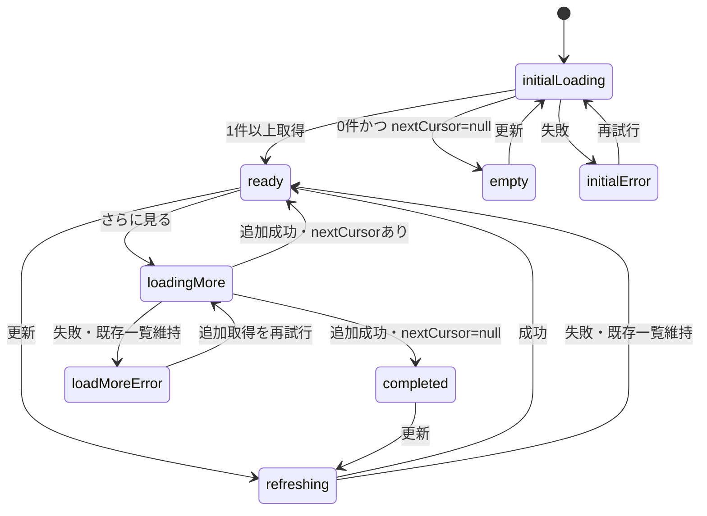
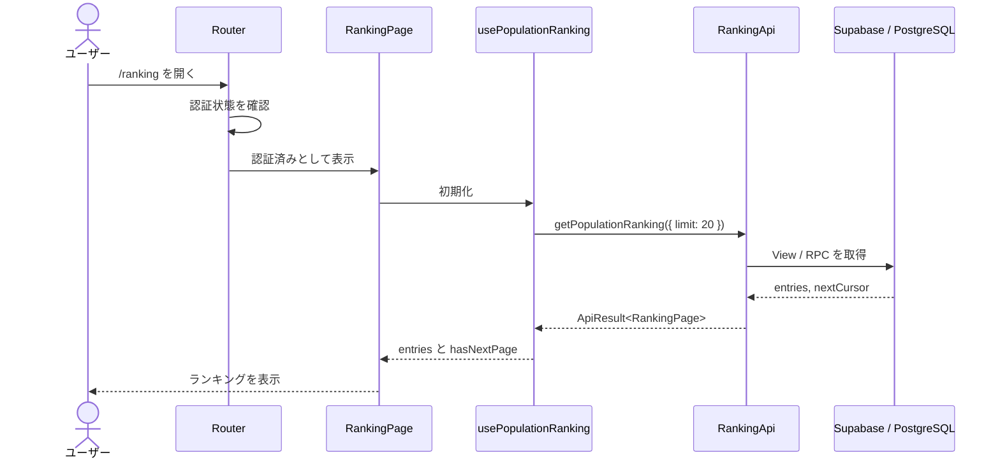
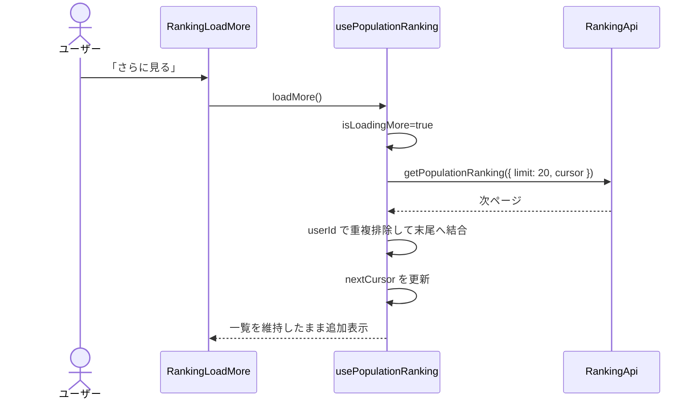
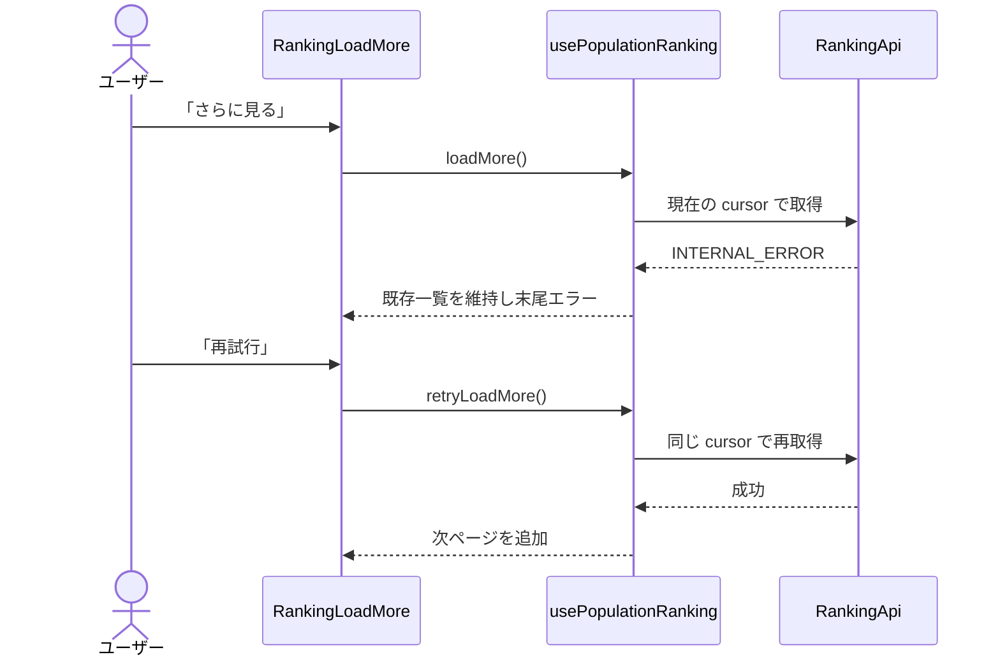
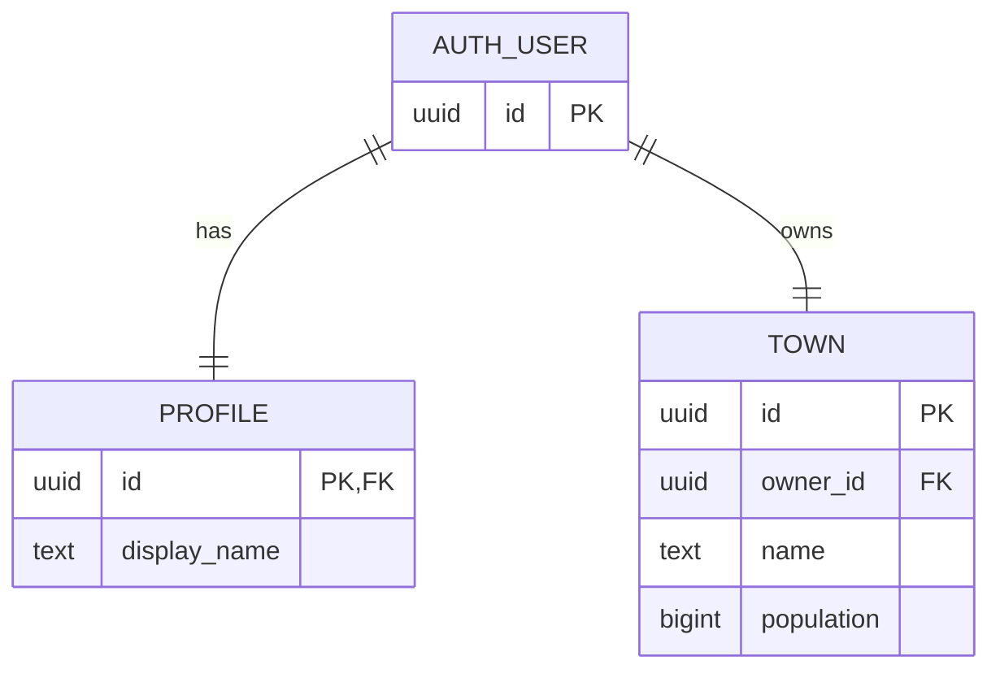

# ランキング機能 計画書

| 項目 | 内容 |
|---|---|
| 対象プロダクト | Walk City |
| ステータス | Draft（フロントエンド・バックエンドレビュー待ち） |
| 作成日 | 2026-08-26 |
| 対象 | 全ユーザー人口ランキングの取得・表示、追加取得、ユーザー／街への遷移 |
| 関連 API | `getPopulationRanking`、遷移先で使用する `getPublicTown` |

## 1. 概要

ランキング機能は、全ユーザーの街を人口順に表示し、ほかのユーザーと自分の順位を確認して、興味を持ったユーザーの街へ移動するための機能である。

フロントエンドは、API が返した順位、人口、表示名、街名を表示し、順位や人口を独自に再計算しない。初回読み込み、空状態、追加読み込み、通信失敗、認証切れを明示的に扱う。バックエンドとの並行開発を可能にするため、同じ `RankingApi` インターフェースを実 API とモック API が実装する。

本書は [Map 機能 計画書](./map機能DesignDoc.md) と同様に、概要、詳細、処理フロー、データ契約、モック、テスト、実装順序、完了条件を一つにまとめる。

## 2. 前提と現状

### 2.1 上位仕様

実装時は次の順で仕様を参照する。

1. API の型・関数・エラーコード: [API 設計書](./API計画書.md)
2. フロントエンドの責務: [フロントエンド設計書](./フロントエンド.md)
3. 配置・依存方向・ルーティング: [フロントエンド詳細技術設計書](./frontend-architecture.md)
4. サーバー権威・公開情報: [バックエンド設計書](./バックエンド.md)、[システムアーキテクチャ](./architecture.md)

文書間に差異がある場合、フロントエンドだけで解釈を固定せず、API 契約と関連文書を同じ変更で更新する。

### 2.2 現在の実装状態

2026-08-26 時点のフロントエンドは、React 19、TypeScript、Vite、Tailwind CSS を導入済みで、Google 認証・Health 連携のモック画面が `src/App.tsx` に集約されている。

一方、次の基盤は未導入または未分割である。

- ルーティングライブラリとルート定義
- `app/`、`components/`、`features/ranking/`、`mocks/`、共有 `types/` の実体
- Supabase JavaScript Client と共通 Supabase Client
- API 実装を環境変数で切り替える Provider
- テストランナーと React コンポーネントテスト環境

ランキング機能の実装では、既存の認証デモを壊さず、ランキングに必要な最小限の共通基盤を切り出す。認証機能全体の再設計や Map 機能の実装までは本機能の変更に含めない。

## 3. 目的と非目的

### 3.1 目的

- `/ranking` で人口ランキングを表示できる。
- 順位、表示名、街名、人口を表示できる。
- `isCurrentUser` に基づいて自分の行を視覚的かつテキストで識別できる。
- 初回読み込み、空状態、初回取得失敗、追加取得中、追加取得失敗、全件取得済みを区別できる。
- `nextCursor` がある間だけ追加取得できる。
- ランキング項目から `/users/:userId` へ遷移できる。
- 実 API とモック API を UI から意識せず切り替えられる。
- モックで通常、同率、空、遅延、初回失敗、追加取得失敗、認証切れを再現できる。
- PC とスマートフォンの双方で読みやすく操作できる。

### 3.2 非目的

次の項目は初期リリースに含めない。

- フロントエンドでの人口または順位の計算
- 日次、週間、地域別、フレンド別ランキング
- 検索、絞り込み、並べ替え条件の変更
- 無限スクロールの自動発火
- リアルタイム購読による順位の自動更新
- ランキングからのフォロー、いいね、メッセージ送信
- ユーザーの公開・非公開設定 UI
- 匿名ユーザーへのランキング公開
- ランキング専用のプロフィール編集

`/users/:userId` と `/town/:userId` の完全な画面実装はユーザー／Map 機能の責務とする。ランキング機能は正しい URL を生成し、遷移できるところまでを担当する。

## 4. 用語

| 用語 | 定義 |
|---|---|
| エントリ | ランキングの1行。順位、ユーザー、街、人口を持つ |
| ページ | 1回の API 応答に含まれるエントリ集合 |
| カーソル | 次ページ取得位置を表す、クライアントから見て不透明な文字列 |
| 初回取得 | 画面表示後、ランキングデータがない状態で行う取得 |
| 追加取得 | 表示済みエントリを維持したまま次ページを取得する操作 |
| 現在ユーザー | Supabase JWT のユーザーと一致し、`isCurrentUser: true` が返るエントリ |
| 実 API | Supabase View、Query または RPC を呼び出すサービス実装 |
| モック API | 外部通信なしで実 API と同じ契約を再現するサービス実装 |

## 5. 仕様上の決定

### 5.1 表示順と順位

- 表示順と `rank` はバックエンドを正とする。
- フロントエンドは受信配列を人口や名前で再ソートしない。
- フロントエンドは配列位置から順位を生成しない。
- 同人口の順位方式が変更されても、フロントエンドは API の `rank` をそのまま表示する。
- ページをまたいで同じ `userId` が返った場合、UI は重複行を増やさず、先に取得した順序を維持して該当エントリを最新値で置き換える。

バックエンドで未確定の同率順位と安定ソートについては、次を推奨案とする。採用時は [API 設計書](./API計画書.md) とバックエンド実装も更新する。

```text
順位: population の降順に対する RANK()（同人口は同順位）
安定表示順: population DESC, display_name ASC, user_id ASC
```

`display_name` は重複し得るため、安定したページングには `user_id` まで含める。フロントエンドはこの内部規則をカーソル解析に使用しない。

### 5.2 ページング

- 初期取得件数は `20` とする。
- API の最大件数はバックエンド合意前のためハードコードせず、フロントエンドは常に `20` を要求する。
- `nextCursor: null` で全件取得済みと判断する。
- カーソルは不透明な文字列として保持し、Base64 や JSON と仮定して解析・生成しない。
- 初期実装は「さらに見る」ボタンによる明示的な追加取得とする。
- 追加取得中は同じボタンを無効化し、二重リクエストを防ぐ。
- 初回再試行は先頭から再取得し、追加取得の再試行は失敗した同じカーソルを使用する。

### 5.3 データ鮮度

- `/ranking` へ入るたびに初回取得する。
- 画面表示中の自動ポーリングは行わない。
- ユーザー操作による「更新」を提供し、成功時は先頭から置き換える。
- 更新失敗時は既存一覧を維持し、一覧上部に非破壊的なエラーを表示する。
- 人口が別画面で変化しても、ランキング画面で推測更新しない。

### 5.4 認証と公開範囲

- `/ranking` は初期版では認証必須とする。
- `isCurrentUser` はサーバーが JWT から判定し、クライアントから対象ユーザー ID を送らない。
- ランキングレスポンスにはメールアドレス、コイン、歩数、Google Health 連携状態を含めない。
- 表示名、街名、人口、公開用 ID だけを UI で使用する。

## 6. 画面 UI

### 6.1 画面構成

```text
┌──────────────────────────────────────────────┐
│ Walk City        街づくり  ランキング  User │
├──────────────────────────────────────────────┤
│ 人口ランキング                     [更新]   │
│ みんなの街の成長を見てみよう                 │
├──────────────────────────────────────────────┤
│ 1  表示名              街名        12,500人 │
│ 2  表示名              街名         9,840人 │
│ 3  あなた   [あなた]   街名         8,210人 │
│ 4  表示名              街名         8,210人 │
│                                              │
│               [さらに見る]                   │
└──────────────────────────────────────────────┘
```

- 共通ヘッダーで現在地を示し、ランキングのナビゲーションを選択状態にする。
- 見出し、補足文、更新ボタン、ランキング一覧、追加取得領域を上から並べる。
- 1〜3位はメダルまたは順位バッジで強調してよいが、順位の意味を色だけに依存させない。
- 各行は順位、表示名、街名、人口を持つ。
- 人口は `Intl.NumberFormat('ja-JP')` で桁区切りし、末尾に「人」を表示する。
- 自分の行には「あなた」ラベルと、スクリーンリーダー用の説明を付ける。
- 行全体または明示的なリンクで `/users/:userId` へ遷移できる。
- クリック可能な `div` は使用せず、リンクまたはボタンを使用する。

### 6.2 レスポンシブ表示

| 項目 | PC | スマートフォン |
|---|---|---|
| 一覧 | 順位、ユーザー、街名、人口を横一列 | 順位と人口を両端、表示名と街名を2段 |
| 余白 | 中央寄せの最大幅コンテナ | 画面幅を使用し左右余白を縮小 |
| 更新 | 見出し右側 | 見出し下または右端 |
| 追加取得 | 一覧下部中央 | 横幅いっぱいに近いボタン |

最小対応幅は 320 px とし、表示名・街名が長い場合は1行省略または2行までに制限する。省略された文字列はアクセシブル名または `title` で確認できるようにする。

### 6.3 画面状態

| 状態 | 表示 | 操作 |
|---|---|---|
| `initialLoading` | 一覧と同じ高さのスケルトンまたはローディング | 更新・追加取得不可 |
| `ready` | 取得済み一覧 | 行選択、更新、必要なら追加取得 |
| `empty` | 「まだランキング参加者がいません」 | 更新可能 |
| `initialError` | エラー文と「再試行」 | 再試行、ほかの画面への移動 |
| `refreshing` | 既存一覧と更新中表示 | 行選択可、更新ボタン無効 |
| `loadMorePending` | 既存一覧と末尾ローディング | 行選択可、追加取得ボタン無効 |
| `loadMoreError` | 既存一覧と末尾エラー | 同じカーソルで追加取得を再試行 |
| `completed` | 既存一覧と「すべて表示しました」 | 更新可能、追加取得不可 |

初回エラーと追加取得エラーを同じ全画面エラーにしない。追加取得の失敗で、すでに表示できている一覧を消さない。

### 6.4 アクセシビリティ

- 一覧は順位付きリストまたは意味のあるテーブル構造を使用する。
- 現在ユーザーの行に `aria-current` 相当の情報と「あなた」のテキストを付ける。
- 読み込み・エラー・更新成功は `aria-live` で通知する。
- フォーカス表示を消さない。
- 「さらに見る」の結果追加後、フォーカスを強制移動せず現在位置を維持する。
- メダル色、自分の背景色、エラー色だけで状態を表現しない。
- 人口を読み上げたときに数値だけで意味が失われないラベルを付ける。

## 7. ルーティング

### 7.1 ルート定義

| Path | Page | 認証 | ランキング機能の責務 |
|---|---|---|---|
| `/ranking` | `RankingPage` | 必須 | 一覧取得・表示・追加取得 |
| `/users/:userId` | `UserPage` | 必須 | ランキング項目の遷移先。詳細実装は別機能 |
| `/town/:userId` | `TownPage` | 必須 | ユーザーページから街を訪問。Map 機能の責務 |
| `/login` | `LoginPage` | 不要 | 未認証時の遷移先 |

### 7.2 遷移ルール

```text
/ranking を開く
  ↓
認証状態を確認中？
  ├─ YES → アプリ共通ローディング
  └─ NO
      ├─ 未認証 → /login へ replace
      └─ 認証済み → RankingPage を表示して初回取得

ランキング項目を選択
  → /users/:userId
  → 「街を訪問」
  → /town/:userId
```

- Path は `app/router.tsx` とリンク生成関数へ集約する。
- `RankingItem` 内で `'/users/' + userId` を手書きしない。
- `userId` は URL セグメントとして `encodeURIComponent` 相当の処理を行う。
- 未定義ルートは共通 Not Found 画面または `/` への案内を表示する。
- ブラウザの戻る・進む、直接 URL 入力、リロードで同じ画面を復元できるルーターを採用する。

### 7.3 初期実装の依存関係

ルーティングには React Router を採用し、`react-router-dom` を依存関係へ追加する。ルートガード、URL 解釈、リンク生成は `app/` に閉じ込め、ランキングコンポーネントへルーター固有 API を広げすぎない。

既存 `src/App.tsx` の認証・Health デモは、ルーター導入時に `LoginPage` または既存機能コンポーネントとして保持する。ランキング実装のために認証モックの振る舞いを削除しない。

## 8. フロントエンド API 契約

### 8.1 共通結果型

```ts
type ApiResult<T> =
  | { ok: true; data: T }
  | {
      ok: false
      error: {
        code: ApiErrorCode
        message: string
        details?: Record<string, unknown>
      }
    }
```

既存認証 API にある機能固有の `ApiResult` は、ランキング追加時にコピーしない。互換性を保ちながら `src/types/common.ts` へ共通化し、認証とランキングの双方が同じ型を参照する。

### 8.2 ランキング型

```ts
type RankingRequest = {
  limit?: number
  cursor?: string
}

type RankingEntry = {
  rank: number
  userId: string
  displayName: string
  townId: string
  townName: string
  population: number
  isCurrentUser: boolean
}

type RankingPage = {
  entries: RankingEntry[]
  nextCursor: string | null
}
```

型は [API 設計書](./API計画書.md) をそのまま採用する。フロントエンドでは受信後に次の最低限の契約検証を行う。

- `rank` は1以上の整数
- `population` は0以上の整数
- ID、表示名、街名は空文字でない
- `entries` は配列、`nextCursor` は文字列または `null`

不正なレスポンスは `INTERNAL_ERROR` へ正規化し、壊れた値を部分表示しない。

### 8.3 Service インターフェース

```ts
interface RankingApi {
  getPopulationRanking(
    input: RankingRequest,
  ): Promise<ApiResult<RankingPage>>
}
```

- UI と Hook は `RankingApi` だけに依存する。
- 実 API とモック API は同じ関数シグネチャを持つ。
- Supabase SDK の `{ data, error }` は Service 内で `ApiResult` へ正規化する。
- Supabase のテーブル名、View 名、RPC 名をコンポーネントへ公開しない。
- `limit` 未指定時は Service が `20` を補う。
- `limit` が正の整数でない場合は通信前に `INVALID_INPUT` を返す。
- 空文字の `cursor` は `INVALID_INPUT` とし、先頭ページを意味する値には変換しない。

### 8.4 実 API アダプター

実 API はバックエンド担当と合意した View／RPCを呼び出す。物理名が未確定の間は Service 内の1か所だけを差し替え可能にする。

```text
RankingPage / Hook
    ↓ RankingApi.getPopulationRanking
SupabaseRankingApi
    ↓ Supabase Query または RPC
PostgreSQL（順位と nextCursor を確定）
```

バックエンドの応答が snake_case の場合、Service 内で camelCase へ変換する。UI に `display_name` や `next_cursor` を渡さない。

バックエンド担当との合意事項は次のとおりである。

- 物理 View／RPC 名と引数名
- JWT 必須であること
- 1回の上限件数
- 同率順位方式
- 安定ソートキー
- カーソルの生成・検証方式
- 無効・改ざんカーソルに対する `INVALID_INPUT`
- 順位算出とページ取得を同じスナップショットで扱う範囲

### 8.5 API エラーと UI

| エラーコード | UI 方針 |
|---|---|
| `UNAUTHENTICATED` | 一覧操作を停止し、`/login` へ再ログインを案内 |
| `INVALID_INPUT` | 一般メッセージを表示。追加取得なら先頭からの更新も案内 |
| `NOT_FOUND` | ランキング全体では通常使用しない。一般エラーへ正規化するか契約を見直す |
| `INTERNAL_ERROR` | 既存一覧を維持し、安全な再試行を提供 |
| 未知のコード | `INTERNAL_ERROR` と同じ一般表示。詳細を画面へ露出しない |

SQL、スタックトレース、テーブル名、JWT、内部カーソル内容をエラーメッセージへ含めない。

## 9. Hook と状態管理

### 9.1 `usePopulationRanking`

Hook は API 呼び出しとページ結合を担当し、表示コンポーネントへ次の形を公開する。

```ts
type PopulationRankingState = {
  entries: RankingEntry[]
  isInitialLoading: boolean
  isRefreshing: boolean
  isLoadingMore: boolean
  initialError: ApiError | null
  loadMoreError: ApiError | null
  hasNextPage: boolean
  refresh: () => Promise<void>
  loadMore: () => Promise<void>
  retryInitial: () => Promise<void>
  retryLoadMore: () => Promise<void>
}
```

### 9.2 状態遷移



### 9.3 競合と古いレスポンス

- 連打による同じ操作の並列実行を防止する。
- 更新開始後に古い追加取得が完了しても、更新後の一覧へ混ぜない。
- コンポーネント破棄後は state を更新しない。
- `AbortController` を使用できる通信方式では、ルート離脱と再取得時に古い要求を中断する。
- 中断できない Supabase 呼び出しではリクエスト世代番号を比較し、古い結果を破棄する。

### 9.4 ページ結合

ページ結合は `userId` を一意キーとして行う。

```text
既存 userId なし → 末尾に追加
既存 userId あり → 既存位置で値を置換
nextCursor       → 最新成功ページの値へ更新
```

フロントエンドで再ソートしない。バックエンド更新によりページ間の順序が大きく変わる可能性がある場合、ユーザーは「更新」で先頭から読み直す。

## 10. モック API とモックデータ

### 10.1 モックの責務

`MockRankingApi` は `RankingApi` を実装し、次を再現する。

- カーソルベースのページ分割
- 疑似遅延
- 現在ユーザーの識別
- 初回取得と追加取得の個別エラー注入
- 不正カーソルの `INVALID_INPUT`
- リセット可能な状態

モックデータをコンポーネントから直接 import しない。画面は必ず `RankingApi` を経由する。

### 10.2 基本モックデータ

基本データは少なくとも25件用意し、初回20件と追加5件を確認できるようにする。

含める代表ケース:

- 1〜3位
- 現在ユーザー
- 人口0のユーザー
- 同じ人口かつ同じ `rank` の2ユーザー
- 長い表示名
- 長い街名
- 日本語、英数字を含む名前
- ページ境界前後のエントリ

モックの `rank` も API 応答値としてデータに持たせ、配列 index から生成しない。

### 10.3 シナリオ

| シナリオ | 期待結果 |
|---|---|
| `default` | 20件表示後、追加5件を取得して完了 |
| `ties` | 同人口・同順位をそのまま表示 |
| `empty` | 空状態を表示し、追加取得を出さない |
| `slow` | ローディング UI と二重操作防止を確認 |
| `initial-error` | 一覧を表示せず、初回再試行を表示 |
| `load-more-error` | 既存20件を維持し、末尾だけ再試行を表示 |
| `unauthenticated` | 再ログイン案内を表示 |
| `invalid-cursor` | `INVALID_INPUT` と更新導線を表示 |

エラー注入は一度だけ失敗させる設定を可能にし、同じ画面で再試行成功まで確認できるようにする。

### 10.4 API 実装の切り替え

```text
VITE_API_MODE=mock     → MockRankingApi
VITE_API_MODE=supabase → SupabaseRankingApi
```

- 切り替えは `app/providers/` の生成時に一度だけ行う。
- コンポーネント内に `if (mock)` を置かない。
- 未定義値や未知の値は起動時に明確な開発者向けエラーとする。
- Supabase URL と Publishable Key は `supabase` モードでのみ必須とする。
- Service Role Key はブラウザ環境変数へ置かない。

## 11. コンポーネント設計

| Component / Page | 責務 |
|---|---|
| `RankingPage` | 画面見出し、共通レイアウト、Hook と一覧の組み合わせ |
| `PopulationRanking` | ランキング機能全体の表示状態切り替え |
| `RankingList` | 取得済みエントリの意味的な一覧構造 |
| `RankingItem` | 1件の順位、ユーザー、街、人口、自分表示、リンク |
| `RankingListSkeleton` | 初回読み込みのレイアウト維持 |
| `RankingEmptyState` | 0件時の説明と更新操作 |
| `RankingLoadMore` | 追加取得、追加中、追加失敗、全件取得済み |

`RankingItem` はデータ取得を行わず、`RankingEntry` と遷移先を Props で受け取る。`RankingList` はページング状態を持たず、表示だけを担当する。

## 12. ディレクトリと変更予定ファイル

```text
frontend/src/
├── app/
│   ├── routes/
│   │   └── RankingPage.tsx
│   ├── providers/
│   │   └── ApiProvider.tsx
│   ├── paths.ts
│   └── router.tsx
├── features/
│   └── ranking/
│       ├── components/
│       │   ├── PopulationRanking.tsx
│       │   ├── RankingList.tsx
│       │   ├── RankingItem.tsx
│       │   ├── RankingListSkeleton.tsx
│       │   ├── RankingEmptyState.tsx
│       │   └── RankingLoadMore.tsx
│       ├── hooks/
│       │   └── usePopulationRanking.ts
│       ├── services/
│       │   ├── ranking.ts
│       │   └── supabaseRanking.ts
│       ├── index.ts
│       └── types.ts
├── mocks/
│   ├── data/
│   │   └── rankings.ts
│   └── services/
│       └── ranking.ts
├── types/
│   └── common.ts
└── lib/
    ├── api-error.ts
    └── supabase.ts
```

実装時にファイル数を減らすことはできるが、Page、表示、Hook、API 契約、実 API、モックデータ、モック API の責務は混在させない。

既存コードへの主な変更:

- `package.json`: ルーター、Supabase Client、テスト基盤の依存関係と scripts を追加
- `src/main.tsx`: Provider と Router のエントリへ変更
- `src/App.tsx`: 認証デモを保持しながら Page／機能コンポーネントへ分離
- `src/index.css`: アプリ全体の基本スタイルのみ維持
- `.env.example`: API モードと Supabase 公開環境変数を記載

## 13. 処理フロー

### 13.1 正常系: 初回表示



### 13.2 正常系: 追加取得



### 13.3 異常系: 追加取得失敗



## 14. バックエンド設計上の要件

### 14.1 データ元

ランキングは `towns.population` と `profiles.display_name`、`towns.name` を基に構成する。人口と順位はサーバーが確定する。



ランキング専用テーブルは初期版では作らず、View または RPC で読み取りモデルを作る。性能計測で必要になった場合のみ Materialized View やキャッシュを検討する。

### 14.2 整合性

- `RankingEntry.population` は同時点の `towns.population` と一致する。
- `rank` はサーバーのクエリで算出する。
- `isCurrentUser` は JWT の `sub` と `userId` の比較で返す。
- 公開対象外の情報を SELECT または RPC 戻り値に含めない。
- ページング中の人口更新で重複・欠落が起こり得ることを前提とし、カーソルに安定ソートキーを含める。
- カーソルの内容を信用せず、署名または厳格な形式・値検証を行う。

### 14.3 性能目標

- 初回20件の API 応答は通常環境で p95 1秒以内を目標とする。
- 必要な列だけを返し、建物一覧や非公開データを結合しない。
- `towns.population` と安定ソートに使用する列のインデックスを実行計画に基づいて検討する。
- フロントエンドは受信済みページのみを DOM に描画する。初期規模では仮想化しない。

## 15. テスト計画

具体的なテストツールは Vitest、React Testing Library、jsdom を採用する。実装前に `test` script を追加する。

### 15.1 単体テスト

- `limit` の既定値が20になる。
- 0、負数、小数の `limit` を `INVALID_INPUT` にする。
- 空文字カーソルを `INVALID_INPUT` にする。
- Supabase の snake_case 応答を正しい `RankingEntry` へ変換する。
- 負の人口、不正な順位、空 ID を不正レスポンスとして拒否する。
- ページ結合時に `userId` の重複を増やさない。
- 重複更新後も既存位置と API の順序を維持する。
- 古いリクエスト結果を破棄する。
- 人口の桁区切り表示が日本語ロケールで正しい。

### 15.2 Hook テスト

- 初回成功、空、初回失敗から再試行成功へ遷移する。
- `nextCursor` がある場合だけ `hasNextPage` が true になる。
- 追加取得中の二重呼び出しを防ぐ。
- 追加取得失敗時に既存一覧とカーソルを維持する。
- 追加取得再試行で同じカーソルを送る。
- 更新成功で一覧を先頭ページへ置き換える。
- 更新失敗で既存一覧を維持する。

### 15.3 コンポーネントテスト

- 順位、表示名、街名、人口を表示する。
- API の順序と `rank` をそのまま表示する。
- 同率順位を同じ数字で表示する。
- 自分の行に「あなた」と識別可能な属性を表示する。
- 項目リンクが `/users/:userId` を指す。
- 初回ローディング、空状態、初回エラーを表示する。
- 追加中、追加エラー、全件取得済みを一覧を消さず表示する。
- `nextCursor: null` で「さらに見る」を表示しない。
- 長い表示名・街名でレイアウトが操作不能にならない。

### 15.4 API 契約・統合テスト

- 認証済みユーザーだけランキングを取得できる。
- 人口の降順と合意した同率ルールで返る。
- `isCurrentUser` が JWT のユーザーにだけ true になる。
- 同じカーソルの再送で同じページを取得できる。
- 不正カーソルを `INVALID_INPUT` として安全に拒否する。
- ページ境界で安定した順序になる。
- ランキング人口と公開街の人口が一致する。
- レスポンスにメール、コイン、歩数、Health 情報が含まれない。

### 15.5 手動確認

- `/ranking` の直接入力、リロード、戻る・進むが動作する。
- 未認証時に `/login` へ誘導される。
- PC と320 px幅のスマートフォンで表示・操作できる。
- キーボードだけで行選択、更新、追加取得、再試行ができる。
- 低速モックでローディングと二重送信防止を確認できる。
- 初回失敗と追加取得失敗をモックメニューまたは設定で再現できる。

## 16. 実装順序と完了条件

### 16.1 実装順序

1. バックエンド担当と物理 API、同率順位、安定ソート、カーソル仕様を合意する。
2. `ApiResult`、`ApiError`、`RankingEntry`、`RankingPage`、`RankingApi` を定義する。
3. 25件以上のモックデータと `MockRankingApi` を実装し、契約テストを作る。
4. `usePopulationRanking` とページ結合・競合防止を実装する。
5. `RankingItem`、`RankingList`、各状態 UI を実装する。
6. React Router、`/ranking`、ルートガード、リンク生成を実装する。
7. API Provider と `VITE_API_MODE` による実 API／モック切り替えを実装する。
8. Supabase Client と `SupabaseRankingApi` を合意した View／RPCへ接続する。
9. 単体、Hook、コンポーネント、契約テストを通す。
10. PC、スマートフォン、低速・失敗シナリオを手動確認する。

モックを先に完成させることで、バックエンド API の完成を待たずに UI とルーティングを検証できる。実 API 接続時は `RankingApi` の実装だけを差し替える。

### 16.2 完了条件

- `/ranking` でモックおよび実 API のランキングを表示できる。
- API が返した順位、表示名、街名、人口、自分の識別を正しく表示できる。
- 20件ずつ追加取得でき、失敗時も取得済み一覧を失わず再試行できる。
- 空、遅延、初回失敗、追加失敗、認証切れを処理できる。
- ランキング項目から `/users/:userId` へ遷移できる。
- コンポーネントが Supabase SDK やモックデータを直接参照していない。
- 実 API とモック API が同じ契約テストを満たす。
- 公開レスポンスと画面にコイン、歩数、メール、Health 情報が露出しない。
- lint、型チェック、build、テストが成功する。
- PC とスマートフォンの手動確認が完了している。

## 17. リスクと対策

| リスク | 影響 | 対策 |
|---|---|---|
| 同率・カーソル仕様が未合意 | ページ境界の重複・欠落、手戻り | 実 API 前にバックエンド担当と決定し API 文書を更新 |
| 現行 `App.tsx` が認証画面に密結合 | ルーター導入時の回帰 | 既存動作をテストまたは手動確認し、段階的に Page へ切り出す |
| 共通 `ApiResult` の重複 | エラー型と UI 分岐の不整合 | ランキング追加時に共通型へ統合し、認証 import も更新 |
| Supabase 物理 API が未完成 | 実データ接続が遅延 | `RankingApi` とモックを先行し、アダプターだけ後から接続 |
| 人口更新中のページング | 重複・欠落 | 安定カーソル、`userId` 重複排除、手動更新を提供 |
| 長い名前や多言語 | レイアウト崩れ | 省略規則、アクセシブルな全文、320 px幅テスト |

## 18. レビュー時に決定する事項

実装着手前に、特に次の4点をフロントエンド・バックエンド間で決定する。

1. 同人口は同順位とするか、安定順に一意の順位を付けるか。
2. View／RPC の物理名、引数、snake_case の応答スキーマ。
3. カーソルの生成方式と1回の最大取得件数。
4. `/users/:userId` の初期画面をランキング実装と同時に用意するか、別機能として後続実装するか。

本書の推奨案は「同人口は同順位」「表示順は人口降順、表示名昇順、ユーザー ID 昇順」「初回・追加取得は20件」「カーソルは不透明」とする。UI とモックはこの推奨案で先行可能だが、実 API 接続前に正式合意を得る。

## 19. 関連文書

- [フロントエンド設計書](./フロントエンド.md)
- [フロントエンド詳細技術設計書](./frontend-architecture.md)
- [API 設計書](./API計画書.md)
- [バックエンド設計書](./バックエンド.md)
- [システムアーキテクチャ](./architecture.md)
- [Map 機能 計画書](./map機能DesignDoc.md)
- [Google 認証・Google Health 連携機能 Design Doc](./Google認証機能DesignDoc.md)
