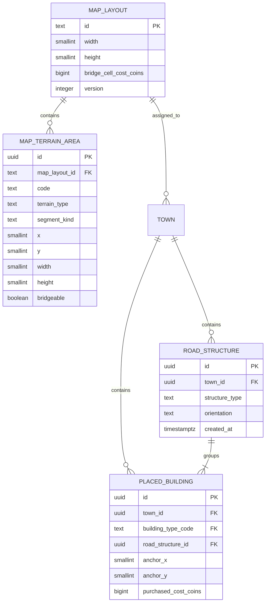
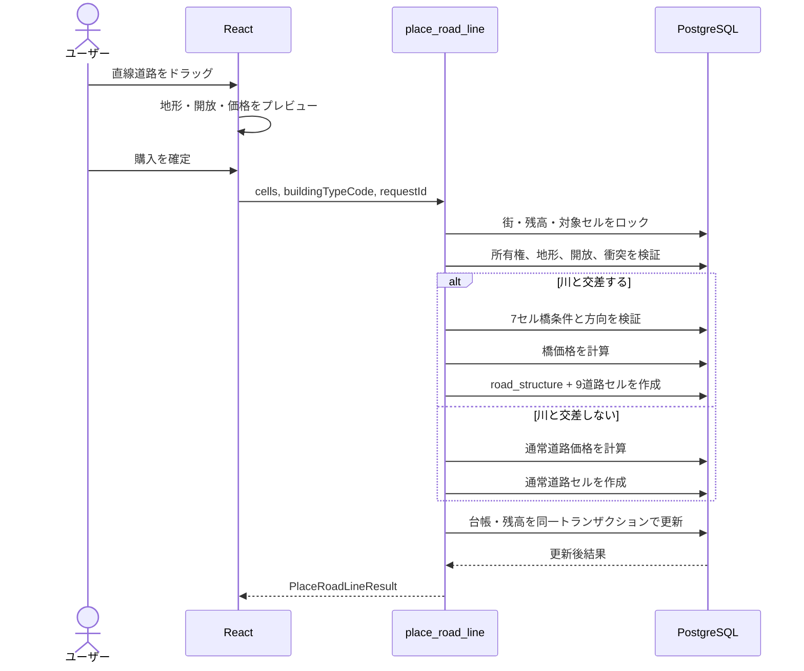
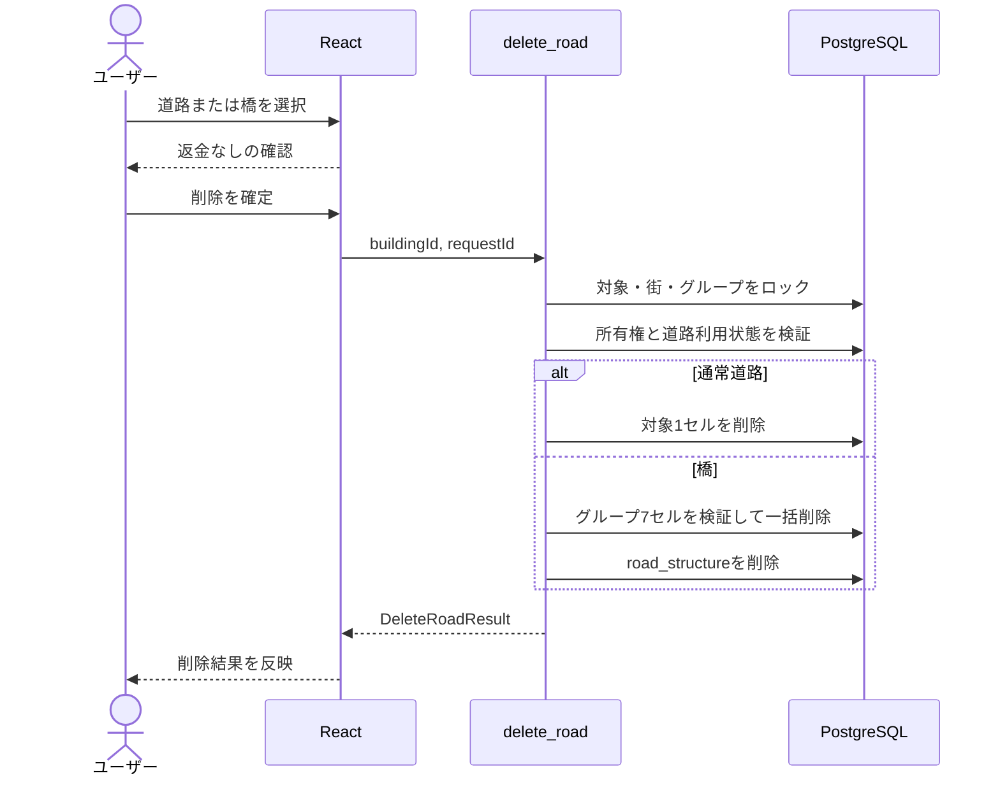

d# 川・橋機能 Design Doc

| 項目 | 内容 |
|---|---|
| 対象プロダクト | Walk City |
| ステータス | 実装中（Phase 1 完了） |
| 作成日 | 2026-08-29 |
| 対象ブランチ | `feat/river-map` |
| 対象範囲 | フロントエンド、モック API、Supabase Migration / RPC / RLS |
| 関連 API | `getMyTown`、`getPublicTown`、`placeBuilding`、`placeRoadLine`、`moveBuilding`、`deleteRoad` |

## 1. 概要

Walk City の全ユーザー共通 100×100 マップへ、固定地形として幅 5 セルの川を追加する。川は未開放領域を含めて常に表示するが、川セルへ通常建物を配置できない。

道路を川の直線部分に対して垂直に、両岸 1 セルずつを含む 7 セルで一度に配置した場合は、自動的に橋として購入・保存・描画する。橋は 7 セルを一つの構造物として扱い、移動できず、削除時も 7 セル全体を一括削除する。

フロントエンドのプレビューと Supabase RPC は同じ座標・価格・橋成立条件を使う。最終的な所有権、開放状態、衝突、地形、価格、残高、削除可否は必ず Supabase 側で再検証する。

## 2. 目的と非目的

### 2.1 目的

- 全ユーザーの街へ同じ位置・形状の川を表示する。
- 未開放エリアでも川の存在を確認できるようにする。
- 川セルへの通常建物配置をフロントエンドとバックエンドの両方で拒否する。
- 条件を満たす道路線を自動的に橋として判定する。
- 通常道路と橋で異なる価格を一つのトランザクションで精算する。
- 通常道路を 1 セル単位、橋を 7 セル単位で安全に削除する。
- 自分の街と他ユーザーの街で同じ川・橋を表示する。
- モック API と Supabase API を同一の TypeScript 契約で利用する。

### 2.2 非目的

- ユーザーによる川の作成、移動、削除、形状変更
- ランダム生成またはユーザーごとに異なる河川
- 川の流れ、波、反射などのアニメーション
- 専用の岸辺、堤防、地形の高低差
- 船、水上建物、港、釣りなどの水上ゲーム要素
- 橋の移動、橋の途中セルだけの削除
- 道路・橋削除時のコイン返却
- 橋の本数制限または橋同士の最小間隔
- 斜め道路、斜め橋、曲線橋

## 3. 確定仕様

### 3.1 川の座標

座標原点はマップ左上 `(0, 0)`、`x` は右、`y` は下へ増加する。川は次の 3 矩形の和集合とする。

| 区間 | X 範囲 | Y 範囲 | 幅 | 流れる向き |
|---|---:|---:|---:|---|
| 下側の横区間 | `0〜69` | `70〜74` | 5 セル | 左から右 |
| 縦区間 | `65〜69` | `20〜74` | 5 セル | 下から上 |
| 上側の横区間 | `65〜99` | `20〜24` | 5 セル | 左から右 |

形状は次のとおりで、曲がり角は 2 か所だけとする。

```text
                    y=20〜24
                    ┌──────────────────→ 右端 x=99
                    │
                    │ x=65〜69
                    │
左端 x=0 ───────────┘
        y=70〜74
```

初期開放領域は `x=40〜59, y=40〜59`。縦区間 `x=65〜69` は、その右隣の 20×20 ブロック `x=60〜79, y=40〜59` を通過する。

### 3.2 重複しない地形領域

描画と橋判定では、重複する 3 矩形を次の 5 領域へ正規化する。

| コード | X 範囲 | Y 範囲 | 種類 | 橋建設 |
|---|---:|---:|---|---|
| `river-lower-straight` | `0〜64` | `70〜74` | 横直線 | 可。縦向きの橋 |
| `river-lower-corner` | `65〜69` | `70〜74` | 曲がり角 | 不可 |
| `river-middle-straight` | `65〜69` | `25〜69` | 縦直線 | 可。横向きの橋 |
| `river-upper-corner` | `65〜69` | `20〜24` | 曲がり角 | 不可 |
| `river-upper-straight` | `70〜99` | `20〜24` | 横直線 | 可。縦向きの橋 |

この 5 領域はセルの重複がなく、川全体を過不足なく表す。

### 3.3 川の表示

- 水面は視認性の高い濃い水色とする。
- 岸辺の専用装飾を追加しない。
- 流れや水面アニメーションを追加しない。
- 川は土地の開放状態より上、グリッド・道路・建物より下へ描画する。
- 川は未開放領域でも隠さない。
- 公開街でも自分の街と同じ形状で表示する。
- 色だけに依存せず、Map の説明または凡例で川であることを伝える。

### 3.4 川セルへの配置

- 道路以外の建物が占有するセルに川が 1 セルでも含まれる場合、配置を拒否する。
- 建物移動先に川が 1 セルでも含まれる場合、移動を拒否する。
- 通常道路を川の途中まで置くことはできない。
- 川に沿って道路を置くことはできない。
- 曲がり角を通過する道路線は橋にならず、配置を拒否する。
- 川と両岸を含む全 7 セルが開放済みの場合だけ橋を建設できる。

### 3.5 橋の成立条件

道路配置 1 回分が次の条件をすべて満たす場合だけ、橋として扱う。

1. 入力セル数が 7 セルである。
2. 7 セルが水平または垂直の一直線で、途中に欠けがない。
3. 中央の連続 5 セルが同じ橋建設可能な川直線領域に含まれる。
4. 両端の 1 セルずつが川の外側の陸地である。
5. 道路線が川の流れる向きに対して垂直である。
6. 7 セルすべてがマップ内かつ開放済みである。
7. 7 セルすべてが未占有である。既存道路との重複も許可しない。
8. 対象が川の曲がり角に接触しない。
9. 認証ユーザーが対象の街を所有している。
10. 橋全体の購入に必要なコイン残高がある。

既存道路への接続は橋の成立条件に含めない。橋同士の隣接や建設数にも制限を設けない。

橋の最小形状は次のとおりである。

```text
陸地 1 セル | 川 5 セル | 陸地 1 セル
     通常道路価格        橋価格        通常道路価格
```

縦川 `x=65〜69` を横断する場合、任意の橋建設可能な `y` に対して `x=64〜70` の 7 セルとなる。横川を縦断する場合も同様に、川の上下へ陸地 1 セルずつを含める。

### 3.6 橋の価格

- 川上の 5 セルは 1 セルあたり 200 コイン。
- 両端の陸地 2 セルは、サーバーカタログが返す通常道路の 1 セル価格。
- クライアントから単価や合計金額を送信しない。
- 合計金額はサーバーが次の式で計算する。

```text
bridgeTotalCost = 5 * bridgeCellCostCoins + 2 * roadCatalogCostCoins
bridgeCellCostCoins = 200
```

- 価格はプレビューにも表示するが、確定値は RPC の計算結果を正とする。
- 配置失敗時は、橋・コイン台帳・残高の一部だけを更新しない。

### 3.7 橋の描画

- 橋は既存道路の色・太さを基礎とする。
- 川上の 5 セルには欄干または縁取りを加え、通常道路と区別する。
- 両岸の 1 セルは橋への進入部分として描画し、通常道路との連続性を保つ。
- 縦川を横断する橋は横向き、横川を横断する橋は縦向きに描画する。
- 接続方向の道路イラストより橋の表示バリアントを優先する。
- アクセシブル名には「橋」、向き、座標、7 セル構造物であることを含める。

### 3.8 道路と橋の移動・削除

- 通常道路は移動不可。
- 橋は移動不可。
- `moveBuilding` に道路または橋の ID が渡された場合、サーバーは拒否する。
- 通常道路は 1 セルずつ削除できる。
- 橋のどのセルを選択しても、同じ橋グループの 7 セルすべてを削除する。
- 橋の一部だけを削除する入力・APIは提供しない。
- 道路・橋を削除してもコインは返却しない。
- 削除前に「コインは返却されません」と対象セル数を確認ダイアログで表示する。
- 削除成功後は、返された ID 一覧に一致する配置物を画面から除去する。

既存建物が道路隣接を必要とする場合、削除によってその条件が失われる道路は `ROAD_IN_USE` で拒否し、街の整合性を維持する。

## 4. データモデル

### 4.1 方針

川座標をフロントエンドと SQL へ別々にハードコードしない。Supabase の共通マップレイアウトを正とし、`getMyTown` と `getPublicTown` が同じ地形領域を返す。フロントエンドとモック API もこのレスポンス型を使う。

橋は 7 個の 1×1 道路配置物と 1 個の道路構造グループとして保存する。これにより、既存の道路描画・占有判定を再利用しつつ、橋の一括削除と表示バリアントを保証する。

### 4.2 ER 図



### 4.3 `map_layouts`

| 列 | 型 | 制約・説明 |
|---|---|---|
| `id` | `text` | PK。初期値 `walk-city-v1` |
| `width` | `smallint` | `100` |
| `height` | `smallint` | `100` |
| `bridge_cell_cost_coins` | `bigint` | `200`、0 以上 |
| `version` | `integer` | レイアウト変更時に増加 |
| `created_at` | `timestamptz` | 作成日時 |
| `updated_at` | `timestamptz` | 更新日時 |

`towns` へ `map_layout_id text NOT NULL REFERENCES map_layouts(id)` を追加し、既存・新規の街へ `walk-city-v1` を設定する。

### 4.4 `map_terrain_areas`

| 列 | 型 | 制約・説明 |
|---|---|---|
| `id` | `uuid` | PK |
| `map_layout_id` | `text` | `map_layouts(id)` FK |
| `code` | `text` | レイアウト内で一意 |
| `terrain_type` | `text` | 初期値は `river` |
| `segment_kind` | `text` | `horizontal`、`vertical`、`corner` |
| `x`, `y` | `smallint` | 左上座標 |
| `width`, `height` | `smallint` | 正の整数 |
| `bridgeable` | `boolean` | 直線部分だけ `true` |
| `created_at` | `timestamptz` | 作成日時 |

制約:

- `UNIQUE(map_layout_id, code)`
- `x >= 0 AND y >= 0`
- `width > 0 AND height > 0`
- 領域右端・下端がレイアウト範囲内であることを Migration または検証関数で保証する。
- 初期 5 領域は seed として Migration に含める。
- 認証済みユーザーは読み取り可能、クライアントからの追加・更新・削除は禁止する。

### 4.5 `road_structures`

| 列 | 型 | 制約・説明 |
|---|---|---|
| `id` | `uuid` | PK |
| `town_id` | `uuid` | `towns(id)` FK |
| `structure_type` | `text` | 初期値は `bridge` |
| `orientation` | `text` | `horizontal` または `vertical` |
| `created_at` | `timestamptz` | 作成日時 |

`placed_buildings` へ `road_structure_id uuid NULL REFERENCES road_structures(id)` を追加する。

- 通常道路は `road_structure_id = null`。
- 橋の 7 セルはすべて同じ `road_structure_id`。
- `road_structures` はクライアントから直接変更せず、配置・削除 RPC だけが更新する。
- 橋グループ削除時は、7 個の `placed_buildings` を先に削除し、その後 `road_structures` を削除する。

## 5. API 契約

### 5.1 共通型の追加

```ts
type MapTerrainArea = {
  id: string
  code: string
  terrainType: 'river' | string
  segmentKind: 'horizontal' | 'vertical' | 'corner' | string
  x: number
  y: number
  width: number
  height: number
  bridgeable: boolean
}

type MapLayout = {
  id: string
  version: number
  bridgeCellCostCoins: number
  terrainAreas: MapTerrainArea[]
}
```

`TownDetail` へ次を追加する。

```ts
type TownDetail = {
  // 既存フィールド
  mapLayout: MapLayout
}
```

`PlacedBuilding` へ次を追加する。

```ts
type PlacedBuilding = {
  // 既存フィールド
  roadStructureId: string | null
  roadVariant: 'normal' | 'bridge_horizontal' | 'bridge_vertical' | null
}
```

非道路では `roadStructureId` と `roadVariant` を `null` にする。通常道路は `roadStructureId = null`、`roadVariant = 'normal'` とする。

### 5.2 `placeRoadLine(input)` の拡張

入力形式は維持する。

```ts
type PlaceRoadLineInput = {
  buildingTypeCode: string
  cells: Cell[]
  requestId: string
}
```

サーバーが地形との交差を確認し、通常道路か橋かを自動判定する。クライアントは `isBridge`、単価、合計金額、構造グループ ID を送信しない。

レスポンスを拡張する。

```ts
type PlaceRoadLineResult = {
  buildings: PlacedBuilding[]
  placementKind: 'road' | 'bridge'
  roadStructureId: string | null
  totalCostCoins: number
  coinBalance: number
  population: number
  updatedAt: string
}
```

橋の場合は 7 個の `buildings`、`placementKind = 'bridge'`、非 null の `roadStructureId` を返す。

### 5.3 `deleteRoad(input)` の追加

```ts
type DeleteRoadInput = {
  buildingId: string
  requestId: string
}

type DeleteRoadResult = {
  deletionKind: 'road' | 'bridge'
  deletedBuildingIds: string[]
  deletedRoadStructureId: string | null
  coinBalance: number
  population: number
  updatedAt: string
}
```

処理:

1. JWT からユーザーを決定する。
2. `buildingId` と所属する街をロックする。
3. 所有者であることを確認する。
4. 対象が道路カテゴリであることを確認する。
5. `road_structure_id = null` なら対象の 1 セルだけを削除する。
6. `road_structure_id != null` なら同じグループの全セルが 7 個であることを検証し、7 セルを削除する。
7. 道路隣接が必要な既存建物の条件を壊さないことを確認する。
8. コイン返却やコイン台帳追加を行わない。
9. 街の `updated_at` を更新する。
10. 削除結果を返す。

同じ `requestId` と同じ入力の再送は、最初の成功結果を返す。異なる入力に同じ `requestId` を使った場合は `CONFLICT` を返す。

### 5.4 `moveBuilding(input)` の変更

対象カタログのカテゴリが `road`、または `road_structure_id` が非 null の場合は `PLACEMENT_IMMOVABLE` を返す。フロントエンドでも道路・橋の詳細に移動操作を表示しないが、認可・整合性は RPC で保証する。

### 5.5 エラーコードの追加

| コード | 条件 | UI 表示 |
|---|---|---|
| `RIVER_BLOCKED` | 通常建物または通常道路が川セルに重なる | 川の上には配置できない |
| `BRIDGE_SPAN_REQUIRED` | 橋候補が 7 セルでない、途切れている、両岸へ届かない | 両岸を含む 7 セルを一度に選ぶ |
| `BRIDGE_DIRECTION_INVALID` | 川と平行、または橋の向きが不正 | 川を垂直に横断するよう案内 |
| `BRIDGE_CORNER_FORBIDDEN` | 川の曲がり角へ橋を配置 | 直線部分を選ぶよう案内 |
| `PLACEMENT_IMMOVABLE` | 道路または橋の移動 | 道路と橋は移動できない |
| `DELETE_NOT_ALLOWED` | 道路以外の対象を道路削除 API へ指定 | この配置物は削除できない |
| `ROAD_IN_USE` | 削除により既存建物の道路条件を壊す | 利用中の道路は削除できない |
| `BRIDGE_GROUP_INVALID` | 橋グループが 7 セルでないなど保存状態が不正 | 再読み込みを案内し、削除しない |

既存の `UNAUTHENTICATED`、`INVALID_INPUT`、`INSUFFICIENT_COINS`、`OUT_OF_MAP`、`LAND_LOCKED`、`CELL_OCCUPIED`、`NOT_OWNER`、`NOT_FOUND`、`CONFLICT`、`INTERNAL_ERROR` も引き続き使用する。

## 6. Supabase RPC 設計

### 6.1 共通ヘルパー

次の判定を SQL 関数として一か所に集約し、配置 RPC と削除 RPC から再利用する。

- 座標がマップ内か
- セルが開放済みか
- セルがどの地形領域に含まれるか
- 川セルか
- 橋建設可能な直線領域か
- 7 セルが正しい橋断面か
- 対象セルが占有済みか
- 道路削除後も建物の道路条件を満たすか

地形判定は `map_terrain_areas` を参照し、フロントエンドから送られた地形情報を信用しない。

### 6.2 `place_road_line`



橋配置では `road_structures` 1 行、`placed_buildings` 7 行、コイン台帳 1 行、残高更新を同じトランザクションで行う。

### 6.3 `delete_road`



処理途中で失敗した場合はすべてロールバックする。橋グループが壊れている場合は安全側に倒し、部分削除しない。

## 7. RLS・認可

| 対象 | 本人 | 他ユーザー | クライアント直接更新 |
|---|---:|---:|---:|
| `map_layouts` | 読取可 | 読取可 | 不可 |
| `map_terrain_areas` | 読取可 | 読取可 | 不可 |
| 自分の `road_structures` | 読取可 | 公開街表示に必要な範囲だけ可 | 不可 |
| 他人の `road_structures` | 公開情報のみ読取可 | 公開情報のみ読取可 | 不可 |
| `placed_buildings` | 既存方針どおり | 公開街表示に必要な範囲だけ可 | 配置・削除 RPC のみ |

- `place_road_line` と `delete_road` は `auth.uid()` から所有者を決定する。
- リクエスト本文の `userId`、`townId`、価格、橋判定を認可根拠にしない。
- Security Definer を使う場合は `search_path` を固定し、対象テーブルをスキーマ修飾する。
- Service Role Key をブラウザへ公開しない。
- 公開街レスポンスへコイン残高や台帳を含めない。

## 8. フロントエンド設計

### 8.1 型・純粋関数

`features/town` に次の責務を追加する。

- 地形矩形から川セル索引を作る。
- セルが川・直線・曲がり角のどれか判定する。
- 7 セルの道路線を橋候補として分類する。
- 橋の向きと両岸セルを判定する。
- 通常道路と橋の合計価格を算出する。
- 建物配置矩形と川セルの衝突を判定する。
- 道路・橋の表示バリアントを解決する。

純粋関数は API 送信前のプレビュー専用であり、サーバー判定の代わりにはしない。

### 8.2 Map 描画レイヤー

下から次の順に描画する。

1. 未開放マップ背景
2. 開放済み領域
3. 川領域
4. グリッド
5. 道路・橋・建物
6. 配置プレビュー
7. 操作パネル

川は 1,000 個以上のセル要素を作らず、5 個の絶対配置矩形として描画する。

### 8.3 道路配置プレビュー

- 川と交差しない場合は既存の道路線プレビューを維持する。
- 川と交差した場合は自動的に橋候補として評価する。
- 7 セル未満・超過、川と平行、曲がり角、途中停止をテキストで案内する。
- 成立時は「橋 5 セル + 進入道路 2 セル」と合計価格を表示する。
- 川上部分を橋のプレビュー、両岸を進入道路のプレビューとして描き分ける。
- 確定後の API 応答がプレビューと異なる場合は API を正として街を更新する。

### 8.4 道路・橋の詳細と削除

- 通常道路詳細には移動ボタンを表示しない。
- 橋セルを選択した場合は、セル単体でなく橋全体の詳細を表示する。
- 通常道路は「道路 1 セルを削除」、橋は「橋 7 セルを削除」と表示する。
- 確認ダイアログに「削除してもコインは返却されません」を表示する。
- 送信中は二重送信を防止する。
- 削除失敗時は対象を残し、エラーと再試行を表示する。
- 他ユーザーの街では削除操作を表示しない。

## 9. モック API

モックは Supabase と同じ契約・ルールを再現する。

- 全ユーザーの `TownDetail` に同じ `walk-city-v1` レイアウトを返す。
- 5 個の地形領域を返す。
- 通常建物と川の衝突を拒否する。
- 正しい 7 セルだけを橋として配置する。
- 橋単価 200 と通常道路単価から合計を計算する。
- 橋へ同じ `roadStructureId` を設定する。
- 通常道路を 1 セル削除する。
- 橋の任意セル指定で 7 セルを一括削除する。
- 道路・橋の移動を拒否する。
- 同じ `requestId` の再送、異なる入力での競合を再現する。
- 疑似遅延、API エラー、例外を注入できる。

## 10. エラー時のUI

| 状態 | UI |
|---|---|
| 川上へ建物配置 | 川の上には建物を配置できないと表示 |
| 橋が 7 セル未満 | 両岸まで一度に選択するよう表示 |
| 橋が 7 セル超過 | 橋は最短 7 セルで配置するよう表示 |
| 川と平行 | 川を垂直に横断するよう表示 |
| 曲がり角 | 川の直線部分を選ぶよう表示 |
| 一部が未開放 | 川と両岸を含む区画の開放を案内 |
| コイン不足 | 必要額と残高不足を表示 |
| 削除対象が利用中 | 接続建物があるため削除できないと表示 |
| 橋グループ不整合 | 削除せず、街の再読み込みを案内 |
| 通信失敗 | 選択状態を維持し、同じ操作を再試行可能にする |
| `CONFLICT` | 街を再取得し、再操作を案内 |

## 11. テスト計画

### 11.1 純粋関数

- 5 地形領域が確定した川座標を過不足なく覆う。
- 川セルと陸地セルを正しく分類する。
- 2 か所の曲がり角を橋建設不可と判定する。
- 縦川を横断する 7 セルを横橋と判定する。
- 横川を縦断する 7 セルを縦橋と判定する。
- 6 セル、8 セル、欠けた 7 セルを拒否する。
- 川と平行な道路線を拒否する。
- 5 川セル + 2 陸地セルの価格を正しく計算する。
- 1×1、2×2 建物と川の衝突を検出する。

### 11.2 コンポーネント

- 未開放領域でも川を表示する。
- 自分の街と公開街で同じ川を表示する。
- 橋の成立・不成立理由を色とテキストで表示する。
- 正しい向きの橋イラストを表示する。
- 通常道路と橋に移動操作を表示しない。
- 通常道路削除で 1 セルの確認を表示する。
- 橋セル選択で 7 セル一括削除の確認を表示する。
- 削除確認に返金なしを表示する。
- 公開街では削除操作を表示しない。

### 11.3 モック・API 契約

- 川上への通常建物配置を `RIVER_BLOCKED` で拒否する。
- 正しい橋配置で 7 個の配置物と 1 個のグループを作成する。
- 橋配置時に正しい合計金額だけを減算する。
- 残高不足時に配置物・グループ・台帳を一切更新しない。
- 同じ `requestId` の再送で二重購入しない。
- 通常道路削除で対象 1 セルだけを削除する。
- 橋の任意セル指定で同じグループの 7 セルを削除する。
- 削除時に残高と台帳が変化しない。
- 他ユーザーの道路・橋を配置、移動、削除できない。
- 公開レスポンスに地形と橋表示情報を含み、コインを含めない。

### 11.4 Supabase統合・RLS

- Migration 適用後、既存の街へレイアウトが設定される。
- 5 地形領域を認証済みユーザーが読み取れる。
- 地形をクライアントから変更できない。
- 配置 RPC が同時実行されても同じセルを二重占有しない。
- 橋配置が途中失敗した場合に全更新をロールバックする。
- 橋削除が途中失敗した場合に 7 セルすべてが残る。
- JWT の所有者と異なる街を更新できない。
- Security Definer 関数の `search_path` が固定されている。

### 11.5 手動確認

- PC とスマートフォンで川と橋が見切れない。
- パン・ズーム時に川と橋がグリッドからずれない。
- 未開放領域の川が確認できる。
- 正しい 7 セルをドラッグして橋を購入できる。
- 橋を隣り合わせに複数配置できる。
- 通常道路と橋の削除確認・キャンセル・成功を操作できる。
- 公開街で川と橋を閲覧でき、編集操作は表示されない。

## 12. 実装順序

### Phase 0: 契約更新

1. 本書をレビューして確定する。
2. `API計画書.md` の型、API、エラーコード、削除 TBD を更新する。
3. `バックエンド.md` のテーブル、配置、削除、RLS 方針を更新する。
4. Map 設計書の障害物・削除に関する旧 TBD を更新する。

### Phase 1: フロントエンド型と地形描画

1. `MapLayout`、`MapTerrainArea`、道路構造フィールドを追加する。
2. 固定レイアウトのモックデータを追加する。
3. 地形判定の純粋関数と単体テストを追加する。
4. 川レイヤー、凡例、公開街表示を追加する。
5. 建物配置・移動プレビューで川衝突を拒否する。

### Phase 2: 橋プレビューとモック配置

1. 7 セル橋判定と価格計算を追加する。
2. 道路配置プレビューへ橋状態を追加する。
3. 橋の表示バリアントを追加する。
4. モック `placeRoadLine` を通常道路・橋の自動判定へ拡張する。
5. 冪等性、残高、エラーのテストを追加する。

### Phase 3: 道路・橋削除

1. `deleteRoad` 契約を追加する。
2. 道路・橋詳細と確認ダイアログを追加する。
3. モックで 1 セル削除と 7 セル一括削除を実装する。
4. 道路・橋から移動操作を除外する。
5. 成功・失敗・再試行・公開街のテストを追加する。

### Phase 4: Supabase Migration / RPC / RLS

1. `map_layouts`、`map_terrain_areas`、`road_structures` を作成する。
2. `towns.map_layout_id`、`placed_buildings.road_structure_id` を追加する。
3. 固定レイアウトと 5 地形領域を seed する。
4. 地形・橋判定 SQL ヘルパーを追加する。
5. `place_building`、`move_building`、`place_road_line` を更新する。
6. `delete_road` と冪等性記録を追加する。
7. RLS と RPC 認可テストを追加する。

### Phase 5: Supabaseアダプターと結合

1. Supabase レスポンスの型検証・正規化を追加する。
2. 実 `TownApi` へ拡張 API を接続する。
3. モックモードと Supabase モードで同じ画面テストを通す。
4. PC・スマートフォン、自己街・公開街を手動確認する。

## 13. 完了条件

- 確定した座標の川が全ユーザーの 100×100 マップへ表示される。
- 川は未開放領域でも表示される。
- 通常建物を川上へ配置・移動できない。
- 正しい 7 セル操作だけが橋として成立する。
- 曲がり角や途中までの道路を橋として配置できない。
- 橋価格が川 5 セル × 200 + 両岸 2 セル × 通常道路価格になる。
- 橋が既存道路を基礎とした専用イラストで表示される。
- 橋を制限なく隣接・複数配置できる。
- 通常道路と橋を移動できない。
- 通常道路を 1 セル、橋を 7 セル単位で削除できる。
- 削除前に返金なしを確認し、削除後も残高が変化しない。
- モック API と Supabase API が同じ契約・エラーを返す。
- RPC が所有権、開放状態、衝突、地形、価格、残高を再検証する。
- RLS と RPC により他ユーザーの街を更新できない。
- ビルド、Lint、単体・コンポーネント・API契約・RLSテストが成功する。

## 14. リスクと対策

| リスク | 影響 | 対策 |
|---|---|---|
| フロントとSQLで川座標がずれる | プレビュー成功後にAPI拒否 | 地形をAPIレスポンスから取得し、DBを正とする |
| 橋7セルの一部だけが保存・削除される | 壊れた橋が残る | グループ化し、単一トランザクションで更新 |
| 同時配置でセルが重複する | Map整合性破壊 | 街・対象セルをRPC内でロック |
| クライアントが価格を改ざんする | 不正購入 | 価格をレイアウトとカタログからサーバー計算 |
| 道路削除で既存建物が孤立する | ゲームルール不整合 | 削除前に道路隣接を再検証し `ROAD_IN_USE` |
| 橋グループが不整合になる | 部分削除 | 7セルを検証し、不整合時は一切削除しない |
| 既存の建物移動PRと競合する | 統合時の回帰 | `main` 更新後に道路カテゴリの移動禁止テストを追加 |

## 15. 関連文書

- [Map 機能計画書](./map機能DesignDoc.md)
- [API 計画書](./API計画書.md)
- [バックエンド設計書](./バックエンド.md)
- [フロントエンド設計書](./フロントエンド.md)
- [システムアーキテクチャ](./architecture.md)
